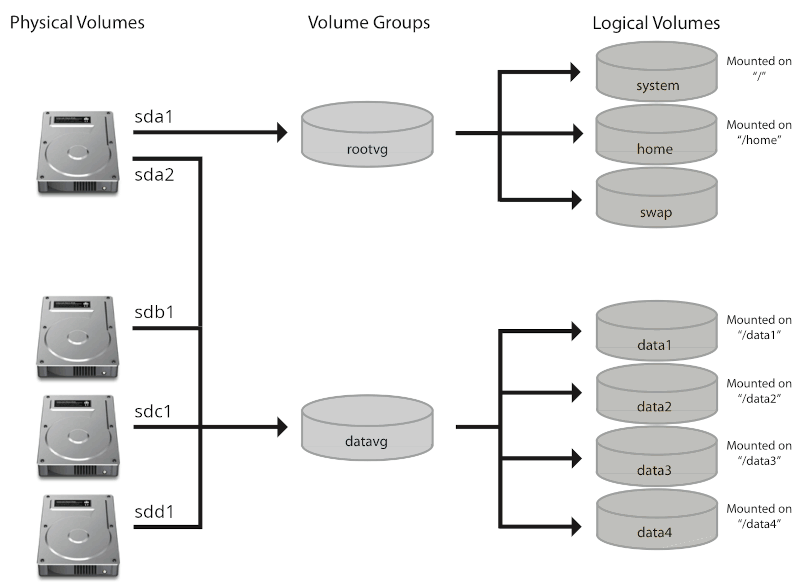

# STORAGE

|**Type**                   |**Description**            |**Examples**|
|-                          |-                          |-|
|**Primary Storage**        |Fast & temporary           |RAM / Cache / Registers|
|**---> Secondary Storage** |Non-volatile & Persitent   |HDD / SSD / Optical / Flash|
|**Tertiary Storage**       |Backup & Archiving         |Tape / Cold Storage|
|**Cloud Storage**          |Online storage             |Google Drive / S3|
|**Virtual Storage**        |Abstracted storage         |NAS / VHD|

## HDD & SSD CONNECTION TYPES

|**Type**       |**Notation**       |**Description**|
|-              |-                  |-|
|**PATA**       |/dev/***hd*X**     |slow Obsolete **parallel** interface, supports **2 devices per adapter** (Master and Slave)|
|**SATA**       |/dev/***sd*X**     |fast Common **serial** interface, supports **4 device per adapter**|
|**SCSI/SAS**   |/dev/***sd*X**     |faster enterprise **parallel** interface, supports **8 devices per adapter**|
|**NVMe**       |/dev/***nvme*X**   |High-speed **parallel** interface, Supports **12 device per adapter**, PCIe-based|

> **!** when a device is connected kernal assigns the device a file in the **/dev** folder & the file is called a **RAW DEVICE**.

---

## PARTITIONING

- ***BIOS uses MBR*** (Master Boot Record) : supports up to **4 primary partitions**, with each primary partition able to\
  contain multiple **extended partitions** that **start numbering from 5**.
- ***UEFI uses GPT*** (GUID Partition Table) : which supports up to **128 partitions**.
- Linux used to detect devices only at boot, but with the spread of USB devices, **udev** was created to detect devices dynamically.
- **udev** automatically creates device files and supports **persistent device files** to keep consistent names after reconnecting\
  by creating files in **/dev/disk** with unique device info and linking them to **/dev**.
- Key folders under **/dev/disk** include:
  * **by-id**: manufacturer, model, serial number
  * **by-label**: device label
  * **by-path**: physical hardware connection port
  * **by-uuid**: unique 128-bit UUID for the device

---

| **fdisk**                                         | **gdisk**                                                                 | **parted** |
| -                                                 |-                                                                          | - |
| **`fdisk `**`[option] [device]`                   | **`gdisk `**`[option] [device]`                                           | **`patred `**`[option] [device] [command [option] ] ` |
| view & manage disk partitions **interactively**   | manage GUID Partition Table (GPT) disks **interactively**                 | manage disk partitions, supports **both MBR and GPT** partition tables |
| older versions **did not support GPT**            | identifies the current formatting and offer **option to convert to GPT**  | can **modify existing partitions** contain **partprobe** utility to triger linux to reread the partition table for a specific device |

**---> Interactive Commands**

| **Command** | **fdisk**                                          | **gdisk**                                        |
| ----------- | -------------------------------------------------- | ------------------------------------------------ |
| **a**       | Enable or disable the bootable flag on a partition |                                                  |
| **b**       |                                                    | Save a backup of GPT data to a file              |
| **c**       |                                                    | Modify the label (name) of a partition           |
| **d**       | Remove an existing partition                       | Remove an existing partition                     |
| **g**       | Initialize a new GPT (GUID Partition Table)        |                                                  |
| **i**       |                                                    | Show detailed information about a partition      |
| **l**       | Display a list of all recognized partition types   | Display a list of all recognized partition types |
| **m**       | Show the help menu                                 |                                                  |
| **n**       | Add a new partition                                | Add a new partition                              |
| **o**       | Create a new DOS partition table (MBR)             | Initialize a new GPT (GUID Partition Table)      |
| **p**       | Show the current partition table                   | Show the current partition table                 |
| **q**       | Exit without saving any changes                    | Exit without saving any changes                  |
| **r**       |                                                    | Access recovery and transformation features      |
| **s**       |                                                    | Arrange partitions in order                      |
| **t**       | Modify the system ID (partition type)              | Modify the type code of a partition              |
| **u**       | Change or display the units used for partitions    |                                                  |
| **v**       | Check the integrity of the partition table         | Scan the disk for errors                         |
| **w**       | Save changes to the disk and exit                  | Save all changes to the disk and exit            |
| **?**       |                                                    | Show the help menu                               |

---

## FILE SYSTEMS

In linux all files reside within the virtual directory. unlike windows which uses drive letters to denote devices connected to the system.

### THE VIRTUAL DIRECTORY

*virtual directory contains a single folder called the **root directory.***\
a **mount point** is a folder placeholder in the virtual directory that points to a physical / logical  device.

    Hard Drive 1
        |-bin
        |-etc       Hard Drive 2
        |-home ----> |
        |-mnt        |-kate
                     |-robert

**FHS ( Filesystem Hierarchy Standard )**

| Directory         | Description |
| -                 | - |
| **/bin**          | Essential user commands for single-user mode |
| **/boot**         | Files needed to boot the system |
| **/dev**          | Interface files for system devices |
| **/etc**          | Configuration files for system services |
| **/home**         | Personal directories for users |
| **/lib**          | Shared libraries required by core programs |
| **/media**        | Mount point for external storage devices |
| **/mnt**          | Temporary mount point for filesystems |
| **/opt**          | Add-on application software packages |
| **/proc**         | Virtual files with process and kernel info (updated in real time) |
| **/root**         | Home directory for the root user |
| **/sbin**         | System management programs |
| **/sys**          | Virtual files showing device and kernel data (updated in real time) |
| **/tmp**          | Temporary files created by applications or users |
| **/usr**          | Shared, read-only data for user applications |
| **/usr/bin**      | Non-essential user commands and applications |
| **/usr/local**    | Locally installed software and related data |
| **/usr/sbin**     | Non-essential system administration binaries |
| **/var**          | Variable data that changes frequently (logs, caches, etc.) |

---

### LINUX FILESYSTEMS

| File System   | Description |
| -             | - |
| **Btrfs**     | - Files & filesystem up to 16 EiB - Built-in RAID support (RAID implementation) - Includes Logical Volume Management (LVM) - Supports built-in snapshots - Fault-tolerant design - Supports data compression |
| **eCryptfs**  | - Unlimited Size - Applies POSIX-compliant encryption before saving data - Only the OS that created the filesystem can access it |
| **Ext3**      | - Files up to 2 TiB and filesystems up to 16 TiB - Evolved from the original Linux filesystem - Journaling supported - Fast startup and recovery times |
| **Ext4**      | - Files up to 16 TiB and filesystems up to 1 EiB - Journaling supported - Enhanced performance compared to Ext3 |
| **XFS**       | - Files up to 8 EiB - High-performance, 64-bit journaling filesystem |
| **Swap**      | - Not intended for persistent data - Used as virtual memory by the system |

**Journaling** : technique used to maintain data integrity in case of unexpected events like power failures, system crashes, or hardware issues.
before making actual changes to files or metadata on disk, the file system first records those changes in a **journal**, a special area of the disk used as a log.
Once the changes are safely recorded in the journal, they are then applied to the actual file system.

---

### NON-LINUX FILESYSTEMS

| File System   | Description|
| -             | - |
| **CIFS**      | Common Internet File System by Microsoft used for reading and writing data over a network |
| **HFS**       | Hierarchical File System by Apple  HFS+ is also supported on Linux |
| **ISO 9660**  | Standard file system for CD-ROMs |
| **NFS**       | Network File System  open-source and used for accessing files over a network |
| **NTFS**      | New Technology File System developed by Microsoft |
| **SMB**       | Server Message Block by Microsoft  proprietary network file system used for file sharing and device interaction |
| **UDF**       | Universal Disk Format  commonly used for DVD-ROMs |
| **VFAT**      | Virtual File Allocation Table  an extended version of FAT, often used on USB drives and other removable storage |
| **ZFS**       | Zettabyte File System developed by Sun Microsystems  known for high storage capacity and data integrity |

---

### MANAGING FILESYSTEMS

|Process            |Commands|
|-                  |-|
|Creating the FS    |`$ mkfs.ext4` `$ mkfs -t ext4` `$ mkfs.fat -F 32` `$ mkfs.vfat` `$ mkfs.msdos`|
|Mounting FS        |`$ sudo mount /dev/sda1 /media/usb` `$ sudo mount -t ext4 /dev/sda1 /media/usb`|
|List mounted Fs'es |`$ sudo mount`|

**Automatic Mounting** : The **/etc/fstab** file contains configuration for automatically mounting filesystems at boot using device **UUID**s, 
and will produce errors if a referenced device is missing.

| Command   | Description |
| -         | - |
| `df`      | Displays disk usage by partition `$ sudo du -d 1` (depth 1) |
| `du`      | Shows disk usage by directory |
| `iostat`  | Provides real-time disk statistics by partition |
| `lsblk`   | Lists current partition sizes and their mount points |
| `fsck`    | file system consistency check **Supported** - ext : full - fat : full - ntfs : partial **Not Supported** - brtfs - xfs - zfs - etc... |

---

**`e2fsprogs` TOOLS**

--> General
| Command       | Description |
| -             | - |
| `blkid`       | Displays information about block devices (e.g., UUID, file system type) |
| `chattr`      | Changes file attributes on the file system (e.g., immutable, append-only) |
| `debugfs`     | Manually view or modify file system structure (e.g., undelete or recover files) |
| `dumpe2fs`    | Displays detailed info about file system blocks and superblocks |
| `e2label`     | Changes or displays the file system label |
| `resize2fs`   | Expands or shrinks an ext2/3/4 file system |

--> XFS
| Command       | Description |
| -             | - |
| `xfs_admin`   | Displays or modifies XFS attributes such as label or UUID |
| `xfs_info`    | Shows XFS details like block size and UUID |
| `xfs_repair`  | Repairs corrupted XFS file systems |

--> Brtfs
| Command       | Description |
| -             | - |
| `balance`     | Balances data chunks across multiple Btrfs devices |
| `check`       | Performs an offline consistency check on a Btrfs file system |
| `device`      | Manages devices within a Btrfs file system |
| `quota`       | Enables and manages disk quotas in Btrfs |
| `filesystem`  | Provides general Btrfs file system management functions |
| `restore`     | Recovers files from a damaged Btrfs file system |

---

## ALTERNATIVE STORAGE

**MULTIPATH**

* Used in enterprise storage systems to increase redundancy and improve performance by allowing  
  multiple physical paths between the server and the storage device.
* Accessed through **/dev/mapper/mpathX** device files.

**dm-multipath** : Kernel module for device-mapper multipath support.\
**multipathd** : Daemon to monitor, activate, or deactivate paths.

| **Command**   | **Description** |
| -             | - |
| `multipath`   | View and manage multipath devices |
| `kpartx`      | Create device mappings for multipath devices |

---

**LVM**

- Flexible system for managing disk storage in Linux aggrgating multiple partitions into logical volumes.
- Allows you to create, resize, and manage disk partitions dynamically.
- **LV** - Logical Volumes are accesed through **/dev/myVGname/myLVname** device files.
- **PV** - Physical volumes & **VG** - Volume groups are not device files.  
  they are just metadata structures managed by LVM.

| **PV Command**    | **VG Command**    | **LV Command**    | **Description**|
| -                 | -                 | -                 | - |
| **pvcreate**      | **vgcreate**      | **lvcreate**      | Create PV, VG, or LV |
| **pvchange**      | **vgchange**      | **lvchange**      | Modify PV, VG, or LV settings |
| **pvremove**      | **vgremove**      | **lvremove**      | Remove PV, VG, or LV |
| **pvdisplay**     | **vgdisplay**     | **lvdisplay**     | Show detailed info about PV, VG, or LV |
| **pvscan**        | **vgscan**        | **lvscan**        | Scan for PVs, VGs, or LVs |
| **pvs**           | **vgs**           | **lvs**           | Display summary statistics for PV, VG, or LV |
| **pvck**          | **vgck**          |                   | Check consistency/integrity of PV or VG metadata |
| **pvmove**        |                   |                   | Move data from one PV to another |
|                   | **vgextend**      | **lvextend**      | Add PV to VG / Extend an LV |
|                   | **vgreduce**      | **lvreduce**      | Reduce a VG by removing PVs/ Reduce the size of a LV |
|                   | **vgcfgbackup**   | **lvmdump**       | Backup VG metadata / Dump LVM config to tarball |
|                   | **vgcfgrestore**  |                   | Restore VG metadata from file |
|                   | **vgexport**      |                   | Make volume Groups unknown to the system, to move it to another system |
|                   | **vgimport**      |                   | Make exported Volume Groups known to the system |
|                   | **vgimportclone** |                   | Import and rename a duplicate VG |
|                   | **vgmerge**       |                   | Merge two VGs into one|
|                   | **vgrename**      | **lvrename**      | Rename VG or LV |
|                   |                   | **lvresize**      | Resize LV (expand or shrink) |

`$ sudo pvcreate /dev/sdb1` --> create PV

`$ sudo vgcreate VOL_1  /dev/sdb1` --> create VG

`$ sudo lvcreate -l 10G -n DISK_1 VOL_1` --> create LV

`$ sudo mkfs.ext4 /dev/mapper/VOL_1-DISK_1` --> create FS

---

**RAID**

The **mdadm** tool allows specifying multiple partitions to be used as RAID.\
RAID Hardware is expensive, therefore LINUX uses software RAID.\
view current status with **/proc/mdstat**.

---

## ENCRYPTING PARTITIONS

`$ sudo cryptsetup -y -v luksFormat /dev/sdb1` --> create a LUKS partition / drive.

`$ sudo cryptsetup -v luksOpen /dev/sdb1 luks1` -->  map LUKS partiton to /dev/mapper/luks1 device file.

`$ sudo cryptsetup -v luksClose /dev/mapper/luks1` --> close the luks mapper (decrypted view).
