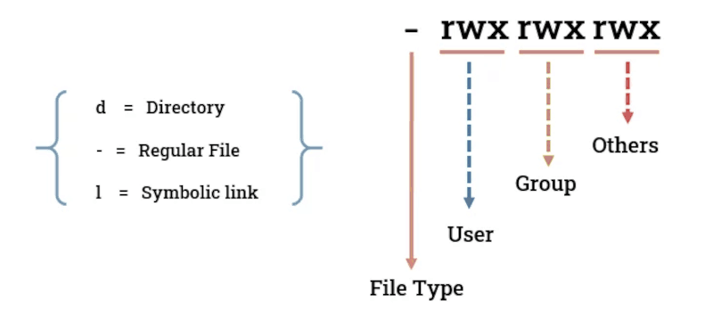
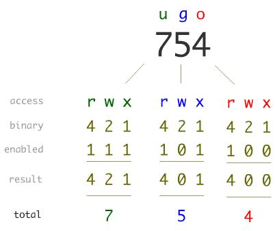
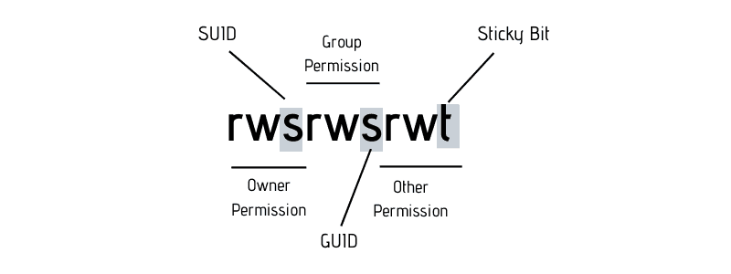

# OWNERSHIP AND PERMISSIONS

## OWNERSHIP

1. **Owner** - user who owns the file / directory.
2. **Group** - each file / directory is associated with a single group.
3. **Others** - all other users on the system, who are not the owner and not in the group.

> **!** when creating users, many linux distros assign the user to a new group with same name as the user.

---

**`chown `**`[-R/-v] [login]:[group] [resource+++]`\
--> change the owner and / or group.

---

**`chgrp`**`[-R/-v] [group] [resource+++]`\
--> change the group ownership of a file or directory.

---

## PERMISSIONS

1. **Read** [ r ]
2. **Write** [ w ]
3. **Execute** [ x ]

| Permission        | File                                              | Directory|
| -                 | -                                                 | - |
| **x** (execute)   | execute (**run**) the file as a script or program | enter or traverse the directory (**cd**)<br>This attribute must be set for **ALL PARENT DIR's** as well|
| **r** (read)      | read file contents (**cat**)                      | list contents (**ls**)|
| **w** (write)     | edit or modify the file (**vim**)                 | create, delete, or rename files inside(**touch**)|

    $ ls -l
    -rwxrw-r-- 1 Adam HR_Group 1542 Jan 14 15:21 file1
    -rwxrw-r-- 1 Adam HR_Group 1542 Jan 14 15:21 file2



---

**`chmod `**``\
--> change the permissions of files or directories.

**Symbolic Mode**

|Symbol | Description|
| -     | - |
| **u** | User (Owner)|
| **g** | Group|
| **o** | Others|
| **a** | All ( user, group and others )|
| **+** | Add permission(s) to the existing set|
| **-** | Remove permission(s) from the existing set|
| **=** | Set exact permission(s), replacing any existing ones|

`$ sudo chmod g+x file1.txt` ---> add x permission to the group

**Octal Mode**

|Octal | Permission|
| -     | - |
|**4**  | Read|
|**2**  | Write|
|**1**  | Execute|

`$ sudo chmod 754 file1` ---> set permissions as **rwxr-xr--**



---

## SPECIAL PERMISSIONS

> **!** special permissions **overwrite execute** permissions.

| Special Bit   | Applies To            | Symbol| Octal | Description                                                                                                       | Setting |
| -             | -                     | -     | -     | -                                                                                                                 | - |
| **SetUID**    |files                  | **s** | **4** | Runs the file with **file owner's privileges**                                                                    | `$ chmod u+s file1`<br>`$ chmod 4754 file1`|
| **SetGID**    |files & directories    | **s** | **2** | **Files** : Run with **file group’s privileges**<br>**Directories** : New files inherit the **directory's group** | `$ chmod g+s file1`<br>`$ chmod 2754 file1`|
| **Sticky Bit**|Directories            | **t** | **1** | Users can only delete **their own files**, even if the directory is writable                                      | `$ chmod o+t dir1` / `$ chmod +t dir1`<br>`$ chmod 1754 dir`|



**s** : normal configuration (user / group has execution permisssion + special permission)\
**S** : possible misconfiguration (user / group has **no** execution permission + special permission)

---

## DEFAULT PERMISSIONS

**User Mask** : Define an octal value to be **subtracted** from permissions when creating a new file or directory.

`$ umask` ---> get current mask (ie. 0022)

> **!** 1st value represents the mask for **special permissions**. eventhough it **cannot** be set manually.

`$ umask 013` ---> set umask for the session.

> **!** to permenantly change umask, add it to the **~/.bash_profile** file.

---

## ACL's

**Access Control List** : allow setting permissions for multiple users and groups.

**`getfacl `**`[option] [resource+++]`\
--> view the Access Control List (ACL) of a file or directory.

    $ getfacl file1
    # file: file1
    # owner: robert
    # group: staff
    user::rw-
    user:bob:r--   # Bob has only read access.
    group::r--
    mask::r--
    other::---

**`setfacl`**`[option] [argument] [resource]`\
--> grant fine-grained permissions on files and directories.

| **Option**    | **Description**|
| -             | - |
| `-m`          | Modify or add an ACL entry|
| `-x`          | Remove an ACL entry|
| `-b`          | Remove all ACLs (reset to standard permissions)|

|**argument**           |**Description**|
| -                     | - |
| `u:name:permissions`  | ACL for the **user** `name`|
| `g:group:permissions` | ACL for the**group** `group`|

> **!** multiple arguments can be passed as a comma ( ***,*** ) list.\
> **!** multiple resources cannot be specified, unless piped as xarg's.\
> **!** there is no output from `setfacl` command.

    $ ls -l
    -rw-r--r--+ 1 robert staff  1024 Aug 11 09:00 report.txt
    drwxr-xr-x+ 3 robert staff  4096 Aug 11 09:30 project/

> **!** The **( + )** sign at the end of permissions is added to indicate that additional ACL's are applied.

---

## CONTEXT BASED PERMISSIONS

**Discretionary Access Control ( DAC )** : Ownership + permission bits + ACLs : (authority : owner)\
**Mandatory Access Control ( MAC )** : Security labels + system-enforced policies : (authority : admin)

In **DAC** there's nothing stopping file owner from giving any permission to any other user.\
**MAC** is used to allow admins to set role based rules. **Role-Based Access Control** is a sub category of **MAC**.

### SELinux (REDHAT)

**Security Enhanced Linux** is a NSA project integrated into RedHat 2.6+.\
Each time a user or process attempts to access an object, SELinux intercepts the attempt and evaluate it against pre-defined policy rules.

**/etc/selinux/config** file controls basic opertaions.

    SELINUX=enforcing
    SELINUXTYPE=targeted

* SELINUX
    - enforcing = enable policies and block unauthorized access.
    - permissive = log policy violations, doesn't enforce them.
    - disabled = disable selinux.

* SELINUXTYPE
    - targeted = only enforce network daemon policies.
    - minimum = only for specified processes.
    - mls = multilayer security, military standard.(top secret, unclassified, public,...)
    - strict = for all daemons ( not recomended ).

**`getenforce`**\
--> check the current operational mode of SELinux. ( enforcing / permissive / disabled )

**`setenforce`**`[0/1]`\
--> change the SELinux mode at runtime.
- 0 : permissive
- 1 : enforcing

**`sestatus`**\
--> display the detailed status of SELinux

    $ sestatus
    SELinux status:                 enabled
    SELinuxfs mount:                /sys/fs/selinux
    SELinux root directory:         /etc/selinux
    Loaded policy name:             targeted
    Current mode:                   enforcing
    Mode from config file:          enforcing
    Policy MLS status:              enabled
    Policy deny_unknown status:     allowed
    Memory protection checking:     actual (secure)
    Max kernel policy version:      33

---

**Security Context**

A security context is a **label** assigned to every:
- File
- Process
- User
- Port
- etc..

indicating what it’s allowed to do, based on the system’s security policy.

Context Format : ***user : role : type : level***
```
    # File Context
    $ ls -Z file1
    -rw-r--r--. root root system_u:object_r:httpd_sys_content_t:s0 file1   
```

```
    # Process Context 
    $ ps -axZ | grep sshd
    system_u:system_r:sshd_t:s0   1234 ? 00:00:00 sshd
```

**Type Enforcement (TE)** defines what objects with a specific type (security context) can access other types
- ie. an application labeled with **sshd_t** can only access files labeled with **sshd_t**, unless the policy allows otherwise.

**SELinux policies** are stored as text files under the **/etc/selinux/** directory structure
- ie. /etc/selinux/**targeted**/.

**Policy management** is handled through the `semodule` utility, which allows you to list, install, and remove **policy modules**, making it easier than writing custom policies from scratch.

**`getsebool`**`[option] [boolname]`\
--> Shows the current on/off status of SELinux booleans.

    $ getsebool -a  #all
    abrt_anon_write --> off
    antivirus_can_scan_system --> off
    httpd_enable_homedirs --> on
    ...

**`setsebool`**`[option] [boolname] [on/off]`\
--> Enables or disables SELinux booleans for the session.

    $ setsebool -P abrt_anon_write on #permanent

---

### AppArmor (DEBIAN)

Restricts what **programs** can do, based on predefined security profiles.

**Application-level confinement** : if an application is compromised, it can only access the specific files and resources allowed in its profile.

AppArmor may be installed by default, but the **apparmor-utils** and **apparmor-profiles** packages must be installed to use its **management tools** and **predefined profiles**.

AppArmor profiles are plain-text files stored in **/etc/apparmor.d/**
- sub directories are named after the application ( ie. **usr.bin.mysqld** )
- define the files and ports the application is allowed to access

| **Command**                       | **Description**|
| -                                 | - |
| `aa-status`                       | Shows the current status of AppArmor (loaded/enforcing profiles)|
| `aa-unconfined`                   | Lists running processes that are **not confined** by any AppArmor profile|
| `aa-complain /usr/sbin/tcpdump`   | **Complain mode** — violations are logged but not blocked|
| `aa-disable /usr/sbin/tcpdump`    | **Disables** the AppArmor profile for the specified application|
| `aa-enforce /usr/sbin/tcpdump`    | **Enables** the AppArmor profile — violations are blocked|

---

## USER TYPES

| **User Type**             | **Description** |
| -                         | - |
| **Root / Super User**     | · **UID : 0**<br> · Primary administrative account on the system<br> · Has unrestricted access to all files, commands and resources|
| **Service/System User**   | · **UID: 1 – 999**<br> · Accounts created by the system or packages to run services and daemons<br> · **Login disabled** ( **\*** or **!** in **/etc/shadow** )<br> · **Shell disabled** ( **nologin** or **false** in **/etc/passwd** )|
| **Standard User**         | · **UID: 1000 +** <br>· Regular login users created by an administrator or during system setup<br> · Can perform admin tasks via **privilege escalation** ( **sudo** )|

---

### ESCALATING PRIVILEGES

| **Command**   | **Description**|
| -             | - |
| **`su`**      | · Stands for **"substitute user"** <br> · Switches to another user account (defaults to root if no username is provided) <br> · Requires the **password of the target account**|
| **`sudo`**    | · Stands for **"substitute user do"** <br> · Executes a command as another user (typically root) <br> · Uses the **current user's own password** <br> · The user must be listed in the **/etc/sudoers** file <br> · **sudoers** defines which users or groups can run commands as root (ie. **sudo** group on Debian/Ubuntu, **wheel** group on RHEL/Fedora) <br> · Always edit the sudoers file using the **`$ EDITOR=vim visudo`** command to prevent syntax errors|
| **`sudoedit`**| · Similar to `sudo`, but only for **editing files with elevated privileges** <br> · Opens the file in a text editor as root without giving full shell access|

---

### RESTRICTING USERS

**`ulimit`**`[option] [limit]`\
--> control or limit access to system resources such as memory, CPU time, and the number of processes.

|**Option** | **Description** |
| -         | - |
| **-a**    | Lists all current limits for the **current shell/user** |
| **-b**    | Sets the **maximum socket buffer size** |
| **-f**    | Sets the **maximum file size** (in blocks) that can be created|
| **-l**    | Sets the **maximum amount of memory** that can be **locked in RAM** |
| **-s**    | Sets the **maximum stack size** |
| **-t**    | Sets the **maximum CPU time** allowed (in seconds)|
| **-u**    | Sets the **maximum number of user processes** that can run simultaneously |
| **-v**    | Sets the **maximum virtual memory size** (address space)|
| **-P**    | Sets the **maximum number of pseudo-terminals** |
| **-T**    | Sets the **maximum number of threads** per process|

---

**`chattr `**`[+/-][attribute] [file/directory]+++`\
--> add or remove special file attributes on files and directories in ext2/ext3/ext4 file systems.

| **Attribute** | **Description** |
| -             | - |
| **a**         | File can only be **opened in append mode** — data can only be added, not removed |
| **A**         | **Access time is not updated** when the file is read (improves performance)|
| **c**         | File is **automatically compressed** on disk |
| **C**         | File is **not copied-on-write** on a journaling filesystem |
| **d**         | File is **excluded from backups** using the **dump** utility |
| **D**         | **Synchronous directory updates** — changes in the directory are written to disk immediately |
| **E**         | File is **encrypted** by the filesystem (if supported) |
| **F**         | For directories: **path lookups are case-insensitive** |
| **i**         | File is **immutable** — cannot be modified, deleted, or renamed (even by root) |
| **s**         | When deleted, file contents are **securely wiped** (blocks are zeroed on disk) |
| **S**         | File updates are **synchronously written** to disk — bypasses cache|
| **u**         | File contents are **saved on delete**, allowing for possible undeletion|
| **V**         | Enables **file authentication** (used in integrity-protected filesystems)|

**`lsattr `**`[-R] [file/directory]`\
--> list special file attributes on files and directories in ext2/ext3/ext4 file systems.

    $ lsattr file1
    ----i-------------- file1
