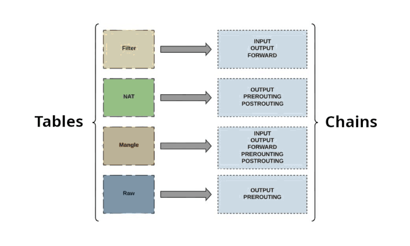

# LINUX FIREWALLS

## ACL's

AKA packet filtering.

The firewall ACL identifies a network packet by reviewing it's control information.
- Source address
- Destination address
- Network protocol
- Inbound port
- Outbound port
- Network status

The firewall takes action on the packet.
- Accept: Allows the packet through.
- Reject: Blocks the packet and sends a response to the sender.
- Drop: Silently discards the packet without notifying the sender.
- Log: Records information about the packet for monitoring or analysis.

The **/etc/services** file is not a configuration file.\
It is a reference that documents network services along with their associated port numbers, protocols, and optional aliases.\
It is used by various system utilities (ie. netstat) and firewall tools (ie. UFW) to map port numbers to service names.

**Format** : [ service_name ] [ port_number/protocol ] [ aliases ]

Ports in the range 1–1023 are known as privileged ports, and only the superuser (root) can bind services to these ports.

---

**FIREWALL MODES**

| Feature               | **Stateless Firewall**                                                    | **Stateful Firewall**|
| -                     | -                                                                         | - |
| **Generation**        | Older technology                                                          | Newer technology|
| **Packet Handling**   | Inspects individual packets only                                          | Monitors and tracks active network connections|
| **Performance**       | Generally faster                                                          | Slightly slower due to deeper inspection|
| **Security**          | More vulnerable to certain types of attacks                               | Resistant to attacks involving fragmented or multi-packet data|
| **Attack Surface**    | Less effective against complex threats                                    | More vulnerable to DDoS attacks due to state tracking|
| **Rule Management**   | Uses static Access Control Lists (ACLs); reboot often required for changes| Rules can adapt based on connection states; more flexible|

> **!** stateful firewall build and maintain a connections table by observing the traffic, allowing faster access times for established connections.

---

## FIREWALL TECHNOLOGIES

**Netfilter** is a packet filtering framework integrated into the Linux kernel, providing essential networking and firewall capabilities.

It is utilized by various firewall tools and services, including :

1. firewalld
2. iptables
3. nftables
4. Uncomplicated Firewall (UFW)

**iptables** and **nftables** interact directly with Netfilter at a low level, offering better performance and efficiency compared to higher-level tools.

> **!** DO NOT use **systemctl** to enable **ufw** service or any other firewall service.

---

### firewalld

- A dynamic firewall daemon for IPv4/IPv6 that supports packet filtering and provides GUI/CLI interfaces.
- It allows real-time rule changes without rebooting.
- Traffic is organized into **Zones**, each with its own trust-level config file (**/usr/lib/firewalld/zones/**).
- Connections can belong to only one Zone, defined by system interface or source IP.

| **Zone**      | **Description**|
| -             | - |
| **drop**      | Drop all incoming traffic; allow outbound|
| **block**     | Allow only outbound traffic; reject incoming with `icmp-host-prohibited` or `icmp6-adm-prohibited`|
| **public**    | Allow selected incoming connections; suited for public networks|
| **external**  | Allow selected incoming connections; used for external networks with masquerading enabled|
| **dmz**       | Allow selected incoming connections; used in a DMZ; limited internal network access|
| **work**      | Allow selected incoming traffic; intended for mostly trusted networks|
| **home**      | Same as *work*; intended for trusted home environments|
| **internal**  | Same as *work*; intended for trusted internal networks|
| **trusted**   | Allow all incoming and outgoing connections|

    $ ls /usr/lib/firewalld/zones
    block.xml   drop.xml   ...

> **!** It’s recommended to use firewalld utilities to change settings, rather than editing XML files manually.

---

**`firewall-cmd`**`[option]`\
--> (CLI) tool used to manage firewalld, the dynamic firewall service in many Linux distributions

| **Option**                    | **Description**|
| -                             | - |
| **--get-zones**               | Lists all available zones|
| **--get-default-zone**        | Displays the current default zone¹|
| **--set-default-zone=<zone>** | Sets the default zone for unassigned interfaces or sources|
| **--get-active-zones**        | Shows active network interfaces and their associated zones|
| **--get-services**            | Lists all predefined firewalld services²|
| **--add-service=<service>**   | Adds a specified system service to the selected zone|
| **--list-services**           | Lists services currently allowed in the selected zone|
| **--panic-on**                | Enables panic mode: blocks all network traffic|
| **--panic-off**               | Disables panic mode: restores normal traffic flow|
| **--runtime-to-permanent**    | Saves current runtime configuration to the permanent environment³|
| **--permanent**               | Applies changes to the permanent configuration; use with other options|
| **--direct**                  | Accesses the direct interface for advanced/custom rule manipulation|

> **!** When used with **--zone=zone** or **--policy=policy**, the command affects the specified zone or policy; otherwise, it affects the **default zone**.

1. The **default** zone is automatically applied to new network interfaces managed by **NetworkManager**.
2. **Firewalld** services are predefined sets of rules (ports, protocols) for common services like ssh, http, dns, etc.
3. Configuration changes affect only the runtime environment unless explicitly saved to the permanent configuration.
```
    $ firewall-cmd --add-service=dns --zone=dmz     #add DNS services to dmz zone
    success
```

---

### iptables

**Tables**: These are rule sets for different purposes. 

| **Table**    | **Purpose**                                                              |
| ------------ | ------------------------------------------------------------------------ |
| **filter**   | Allows or blocks packets based on rules defined in the chain.            |
| **mangle**   | Alters packet properties (ie. TOS, TTL) during processing.               |
| **nat**      | Changes source or destination addresses of packets (used for NAT).       |
| **raw**      | Applies settings like `NOTRACK` to bypass connection tracking.           |
| **security** | Applies Mandatory Access Control (MAC) rules using systems like SELinux. |




**Chains**: Each table contains chains, which are lists of rules applied to packets.

| **Chain**       | **Description**                                                           |
| --------------- | ------------------------------------------------------------------------- |
| **PREROUTING**  | Handles incoming packets **before** any routing decision is made.         |
| **INPUT**       | Handles packets **destined for the local system**.                        |
| **OUTPUT**      | Handles packets **originating from the local system**.                    |
| **FORWARD**     | Handles packets **passing through the system** to another destination.    |
| **POSTROUTING** | Handles packets **after routing**, just **before they leave the system**. |

---

Each chain has a **policy**, which is the default action applied to packets if they don’t match any rules in the chain.

- ACCEPT: Allow the packet.
- DROP: Silently discard the packet.
- REJECT: Discard the packet and send an error response.

---

**`iptables `**`-t [table] [option] [chain] [match_condition] -j [policy]`\
--> set up, maintain, and inspect the system's firewall rules.

---> Option
| **Option**| **Description**|
| -         | - |
| **-A**    | Append rule to chain|
| **-I**    | Insert rule at top (or specific position) in chain<br>Important since rules are evaluated in order|
| **-D**    | Delete a rule from chain|
| **-R**    | Replace a rule in chain|
| **-L**    | List rules in chain|
| **-F**    | Flush all rules in chain|
| **-P**    | Set default policy on chain|
| **-S**    | Displays all rules in the form of iptables commands|

---> Policy
| **Action**    | **Description**|
| -             | - |
| **ACCEPT**    | Allow the packet|
| **DROP**      | Silently discard the packet|
| **REJECT**    | Discard the packet and send an error response|

---> Match_Condition
| **Match Option**                      | **Description**|
| -                                     | - |
| **-s**, **--source**                  | Source IP address or subnet.|
| **-d**, **--destination**             | Destination IP address or subnet. |
| **-p**, **--protocol**                | Protocol (e.g., TCP, UDP, ICMP). |
| **-i**, **--in-interface**            | Packets entering on a specific interface. |
| **-o**, **--out-interface**           | Packets leaving via a specific interface. |
| **--sport**, **--source-port**        | Source port (TCP/UDP only). |
| **--dport**, **--destination-port**   | Destination port (TCP/UDP only).|

```
    # Make changes permenent

    sudo iptables-save > /etc/sysconfig/iptables       # RHEL-based
    sudo ip6tables-save > /etc/sysconfig/ip6tables

    sudo iptables-save > /etc/iptables/rules.v4        # Debian/Ubuntu
    sudo ip6tables-save > /etc/iptables/rules.v6
```

---

### nftables

> **!** nftables use the same same chain / table / policies /rules concepts as iptables, but the format is simplified.

`$ nft list tables`\
--> list current tables.

`$ nft add table [family] [table]`\
--> add a new table.

`$ nft list table [family] [table]`\
--> view a table.

`$ nft 'add chain [family] [table] [chain] { type [type] hook [hook] priority [priority]; policy [policy]; }'`\
--> add a chain.

`$ nft 'add rule [family] [table] [chain] [match] [action]'`\
-- add a rule.

> ! Notice the single quotes.

`$ nft flush table [family] [table]`\
--> flush rules from table.

`$ nft delete chain [family] [table] [chain]`\
--> delete chain from table.

`$ nft delete table [family] [table]`\
--> delete a table.

---> family
| **Family**| **Description**|
| -         | - |
| **ip**    | IPv4 traffic only|
| **ip6**   | IPv6 traffic only|
| **inet**  | Combined IPv4 and IPv6 (recommended for modern use)|

---> type
| **Type**  | **Description**|
| -         | - |
| **filter**| Used for packet filtering (accept/drop)|
| **nat**   | Used for network address translation|

---> policy
| **Policy**| **Description** |
| -         | - |
| **accept**| Accept packets if no rule matches|
| **drop**  | Silently discard packets if no rule matches|

---> hooks for filtering and nat
| **Hook**          | **Description** |
| -                 | - |
| **prerouting**    | Before routing decisions are made(NAT)|
| **input**         | For packets **destined** to the local machine |
| **forward**       | For packets routed **through** the system |
| **output**        | For packets **generated** by the local system(NAT) |
| **postrouting**   | After routing, just before the packet leaves(NAT)|

---

### UFW

***Config File* : /etc/default/ufw**

> **!** user-friendly command-line frontend for iptables (or nftables on newer systems), by default **ufw** service is disabled.

**SYNTAX**

| **Syntax**                                                                      | **Description**|
| -                                                                             | - |
| `ufw` **`[ enable / disable / reload / reset ]`**                             | Control UFW state: turn on, turn off, reload rules, or reset to defaults|
| `ufw` **`[ RULE ]`**                                                          | Add a rule (e.g. allow, deny, reject, limit) to filter traffic|
| `ufw` **`default [ allow / deny / reject ] [ incoming / outgoing / routed ]`**| Set default firewall behavior per traffic direction|
| `ufw` **`logging [ on / off / LEVEL ]`**                                      | Enable or disable logging; set detail level (`low`, `medium`, `high`, `full`)|
| `ufw` **`status [ verbose / numbered ]`**                                     | Show current firewall status and rules; optionally with details or numbers|
| `ufw` **`delete [ NUMBER / RULE ]`**                                          | Remove a rule by its number or full rule syntax|
| `ufw` **`insert [ NUMBER ] [ RULE ]`**                                        | Insert a rule at a specific position in the rule list|
| `ufw` **`app [ list / info / default / update ]`**                            | List, View and Manage application profiles used for predefined rules|

**RULE SYNTAX**

| **Rule Component**| **Description**                               | **Syntax**|
| -                 | -                                             | - |
| **Port**          | Specify a port number or range                | **22**  -  **80\tcp**  -  **88\udp**  -  **1000:2000**|
| **Protocol**      | Specify protocol: TCP or UDP                  | **proto tcp**  -  **proto udp**|
| **From**          | Source IP address or subnet                   | **from 192.168.1.0 -24**  -  **from any**|
| **To**            | Destination IP address or subnet              | **to 10.0.0.5**  -  **to any**|
| **Port (to)**     | Destination port                              | **to any port 80**  -  **to any port 443**|
| **Direction**     | Specify traffic direction: inbound or outbound| **in**  -  **out**|
| **Interface**     | Network interface                             | **on eth0**  -  **on wlan0**|
| **Application**   | Application profile name                      | **"OpenSSH"**  -  **"Nginx Full"**|
| **policy**        | Allowed policies                              | **allow**  -  **deny**  -  **reject**|
| **comment**       | Optional, comments                            | **comment  "message"**|

• No need to **ufw reload** after rule changes.\
• Rules are saved to **/etc/ufw/user.rules** and **/etc/ufw/user6.rules**.\
• UFW uses **profiles** for common apps, stored in **/etc/ufw/applications.d/**.\
• Do **not** modify default **profiles**; instead, create **/etc/ufw/applications.d/custom.d/**, add your profiles, and run `sudo ufw app update all`.

---

`$ ufw status verbose`\
--> display detailed status of UFW.

```
Status: active
Logging: on (low)
Default: deny (incoming), allow (outgoing), deny (routed)
New profiles: skip

To                         Action      From
--                         ------      ----
22/tcp                     ALLOW IN    Anywhere                  
80/tcp                     ALLOW IN    Anywhere                  
443/tcp                    ALLOW IN    Anywhere                  
22/tcp (v6)                ALLOW IN    Anywhere (v6)             
80/tcp (v6)                ALLOW IN    Anywhere (v6)             
443/tcp (v6)               ALLOW IN    Anywhere (v6)             
```

| **Category**      | **Option**| **Description**|
| -                 | -         | - |
| **Status**        | active    | UFW firewall is enabled and enforcing rules|
|                   | disabled  | UFW firewall is turned off|
| **Logging**       | off       | Logging is disabled|
|                   | low       | Logs blocked packets only|
|                   | medium    | Logs blocked, invalid, no-policy-match, new connections with rate limiting |
|                   | high      | Logs all packets with rate limiting|
|                   | full      | Logs all packets|
| **Default**       | accept    | Default policy to accept packets (incoming/outgoing/routed)|
|                   | deny      | Default policy to silently drop packets|
|                   | reject    | Default policy to drop packets and send error response|
| **New Profiles**  | ACCEPT    | Allow traffic (potential security risk)|
|                   | DROP      | Silently discard traffic|
|                   | REJECT    | Reject traffic and send error response|
|                   | SKIP      | Skip the profile during processing|

---

`$ ufw status numbered`\
--> display numbered rules of UFW.

```
Status: active

     To                         Action      From
     --                         ------      ----
[ 1] 22/tcp                     ALLOW IN    Anywhere                  
[ 2] 80/tcp                     ALLOW IN    Anywhere                  
[ 3] 443/tcp                    ALLOW IN    Anywhere                  
[ 4] 22/tcp (v6)                ALLOW IN    Anywhere (v6)             
[ 5] 80/tcp (v6)                ALLOW IN    Anywhere (v6)             
[ 6] 443/tcp (v6)               ALLOW IN    Anywhere (v6)
```

---

`$ ufw app info OpenSSH`\
--> view information about OpenSSH profile.

```
Profile: OpenSSH
Title: OpenSSH Server
Description: OpenSSH is a free version of the SSH connectivity tools that technical users of the Internet rely on.

Ports:
  22/tcp
```

---

## IP PACKET FORWARDING

kernel's ability to act as a router, forwarding IP packets between network interfaces when the destination of a packet is not the local system itself.

`$ sysctl -w net.ipv4.ip_forward=1` / `$ echo 1 > /proc/sys/net/ipv4/ipforward` --> Temporarily enable for IPv4.

`$ sysctl -w net.ipv6.conf.all.forwarding=1` / `$ echo 1 > /proc/sys/net/ipv6/conf/all/forwarding` --> Temporarily enable for IPv6.

Add `net.ipv4.ip_forward=1` /  `net.ipv6.conf.all.forwarding=1` to `/etc/sysctl.conf` --> Permenantly enable.

---

## DYNAMIC RULE SETTING

> **!** **Intrusion Detection Systems** can monitor traffic for suspicious behavior and modify firewall rules accordingly.

### DenyHosts

- A Python-based security tool.
- Designed to prevent **brute-force** attacks targeting **OpenSSH**.
- Can run as a **cron job** or **background service**.
- Monitors SSH authentication logs from **/var/log/auth.log** and **/var/log/secure**.
- Automatically adds offending IP addresses to **/etc/hosts.deny** after multiple failed login attempts (uses TCP Wrappers).
- Configurable via the **/etc/denyhosts.conf** file.
- Supports **only IPv4** traffic for OpenSSH.

### Fail2Ban

* Monitors system and application logs for suspicious activity.
* Automatically blocks IP addresses or users after **multiple failed login** attempts.
* Can integrate with **TCP Wrappers**, **iptables**, **firewalld**, and other firewall tools.
* The `fail2ban-client` utility is used to monitor and manage log-based bans.
* Configuration is managed through **`/etc/fail2ban/jail.conf`**, which specifies the services to monitor, log file paths, and ban policies.
* Susceptible to **false positives**, especially in high-traffic environments.
* You can configure **ban release times** (unban timers) to reduce the impact of false positives.

### IPset

* Allows creation of named sets containing IP addresses, MAC addresses, ports, interfaces, or entire subnets.
* Simplifies the management of these groups when integrating with firewalls (e.g., **iptables**, **nftables**) for filtering or access control.

`$ ipset create / n [set-name] [storage-method]:[set-type]`\
--> create set.

| Storage-Method : Set-Type | Description |
| -                         | - |
| **hash:ip**               | Stores individual IP addresses (IPv4 or IPv6)|
| **hash:net**              | Stores IP subnets (ie. 192.168.0.0/24)|
| **hash:mac**              | Stores MAC addresses|
| **hash:ip,port**          | Stores IP address + port combinations|
| **hash:net,port**         | Stores subnet + port pairs|
| **hash:ip,port,ip**       | Stores source IP + port + destination IP triples|
| **hash:ip,port,net**      | Stores source IP + port + destination subnet|
| **bitmap:ip**             | Stores a contiguous range of IPv4 addresses (within a /16)|
| **bitmap:port**           | Stores a range of ports (0–65535)|
| **list:set**              | Stores other IP sets by name (nested sets)|

`$ ipset add [ name ] [ ip / MAC / port / interface / subnet ]`\
--> add entry to set.

`$ ipset del [ name ] [ ip / MAC / port / interface /subnet ]`\
--> delete an entry.

`$ ipset destroy / x [ name ]`\
--> destroy a set.

`$ ipset list`\
--> display the contents of sets.

```
Name: blacklist
Type: hash:ip
Revision: 4
Header: family inet hashsize 1024 maxelem 65536
Size in memory: 16592
References: 1
Number of entries: 2
Members:
192.168.1.100
203.0.113.45
```

> **!** There is no official or standard **ipset.service** file shipped with most distributions (systemd).\
> **!** **ipset** is a command-line tool, **not** a **daemon**. it just modifies kernel data structures when **called**.
