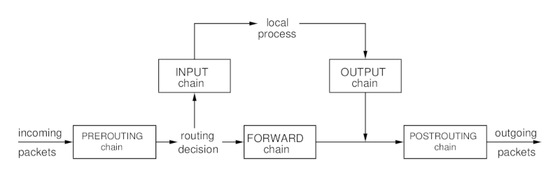

# LINUX FIREWALLS

## ACL's

AKA packet filtering.

The firewall ACL identifies a network packet by reviewing it's control information.
- Source address
- Destination address
- Network protocol
- Inbound port
- Outbound port
- Network status

The firewall takes action on the packet
- Accept
- Reject
- Drop
- Log

> Reject send a response to the sender, while Drop does not.

**/etc/services** file documents application services and their ports, protocols and aliases.\
! this is not a config file.\
this file is used by various utilities (netstat,..) and firewalls (UFW,...).

Format - **serviceName PortNumber/ProtocolName [ Aliases ]**

ports 1 - 1023 are privileged ports. onlu super user can run services on these.

Firewalls can operate in Following methods,

- Stateless
    * older of the two.
    * focus only on individual packets.
    * faster.
    * vuneralbe to certain attacks.
    * ACL rules are static, firewall must reboot.

- Stateful
    * monitor active network connections.
    * group packets.
    * look for fragmented packets.
    * not vunerable to attacks using multiple spread packets.
    * more vunerable to DDoS attacks.

stateful firewall build and maintain a connections table by observing the traffic, 
it uses this table to monitor individual connections. allowing faster access times for established connections.

## FIREWALL TECHNOLOGIES

**netfilter** embeded in the kernal offering packet filtering services.\

- **netfilter** is used by,
    + **iptables** firewall software.
    + **firewalld** service.
    + **nftable** service.
    + **Uncomplicated Firewall** software.

> **iptables** & **nftable** has low level access to **netfilter** making them faster.

### firewalld

* provides packet filtering and interfaces for the GUI and CLI.
* IPv4 / IPv6
* AKA dynamic firewall daemon, can change ACL rules without reboot.
* traffic is grouped into predefined rule sets ( **Zones** ).
* each **Zone** has it's own config file ( **Trust level** ).
* a connection can be member of only one **Zone**. 
* traffic can be grouped by System Interface or Source IP.
* **/usr/lib/firewalld/zones/**

.

    Predefined Zones

    drop        drop all incomming, allow outbound.

    block       accept only connections originating from the system,
                reject other packets and send "icmp-host-prohibited".
                or "icmp6-adm-prohibited" message back.

    public      accept only selected incomming connections,
                used in public setting.

    external    accept only selected incomming connections.
                used in external networks.
                when "masquerading" is enabled on local system.

    dmz         accept only selected incomming connections.
                used in the demilitirized zone.
                publically accessible, has limited access to internal network.

    work        accept only selected incomming network traffic.
                where other systems are mostly trusted.

    home        accept only selected incomming network traffic.
                where other systems are mostly trusted.

    internal    accept only selected incomming network traffic.
                where other systems are mostly trusted.

    trusted     accept all network connections.

**firewall-cmd** allows intercating with the firewalld config settings.

`$ ls /usr/lib/firewalld/zones`

    block.xml   drop.xml   ...

! it is better to change settings using firewalld utilities, rather than manually editing "xml".

`$ firewall-cmd`

    --get-zones                 get a list of available zones.
    --get-default-zone          show default zone. (1)
    --set-default-zone          set the default zone.
    --get-active-zones          list active connections with corresponding zones.
    --get-services              list firewalld services. (3)
    --add-service=srv           add a system service to firewalld.
    --list-services             list configured services.
    --panic-on                  in case of emergency, block traffic.
    --panic-off                 re-enable traffic.
    --runtime-to-permenent      make configuration changes permenent. (2)
    --permenent                 use with other commands, to add changes to both runtime and permenent environments.
    --direct                    firewalld direct interface.

1. **Network Manager** is integrated with **firewalld**, the default zone is applied to new network devices.

2. Any configuration changes is only applied to the firewalld **runtime environment**.\
   they must be added to the **permenent environment** by command.

3. **firewalld** services are predefined configuration sets for system services such as DNS,etc...

`$ firewall-cmd --add-service=dns --zone=dmz`\
< add DNS services to dmz zone >

    success

`$ firewall-cmd --list-services --zone=dmz`

    ssh dns

### iptables

> ! **iptables** must not run alogside **firewalld**

iptables service uses a process called "chains" to handle network traffic.

- PREROUTING - handles packets before the routing.
- INPUT - handles packets destined for local system.
- OUTPUT - handles packets from output from local system.
- FORWARD - handles packets being forwarded to a remote system.
- POSTROUTING - handles packets after "forward" filter.

each chain contains tables that define rules for handling passing packets.\
there are 5 table types,

- filter
    * allow or block packets from exiting the chain.
- mangle
    * change features of passing packets.
- nat
    * chage addresses of passing packets.
    * NAT
- raw
    * apply a "NOTRACK" setting to packets that are not to be tracked.
- security
    * apply manadatory access control rules.

packets are,
heads.of.state.2025.1080p.web.dl.hevc.x265.rmteam
- ACCEPT
- DROP

.

    -L [chain]                  List rules for [chain] / all chains.
    -S [chain]                  List rule details for [chain] / all chains.
    -t [table]                  Apply the command to [table] / filter table (default).
    -A [chain] [rule]           Add new [rule] to [chain].
    -I [chain] [index] [rule]   Insert [rule] to [chain] at [index] location.
    -D [chain] [rule]           Delete [rule] from [chain].
    -R [chain] [index] [rule]   Remove [rule] from [chain] at [index].
    -F [chain]                  Flush all rules from [chain] / all chains.
    -P [chain] [policy]         Define default Policy for the chain.

> To make changes persistent, use **iptables-save** command\
> and redirect output to **/etc/sysconfig/iptables** & **/etc/sysconfig/ip6tables**.\
> for ubuntu **/etc/iptables/rules.v4** & **/etc/iptables/rules.v6**.

### nftables

nftables use the same same chain / table / policies /rules concepts as iptables, but the format is simplified.

`$ sudo nft list tables`

    table ip filter
    table ip6 filter
    table ip security
    table ip6 security
    table ip raw
    table ip6 raw
    ...

`$ sudo nft add table ip Adam`

`$ sudo nft list table ip Adam`

    table ip Adam {

    }

**Adding a new Chain**

    $ nft 'add chain [ family ] [ table ] [ chain ] {
        type [ type ] hook [ hook ] priority [ priority ] ; 
        policy [ policy ] ; 
        comment [ "comment" ] ; 
        }'

`$ sudo nft 'add chain ip Adam TestChain { type filter hook input priority 0 ; policy drop ; comment "for testing only" ; }'`

> ! Notice the single quotes.

`$ sudo nft list table ip Adam`

    table ip Adam {

        type filter hook input priority filter ; policy drop ;  comment "for testing only" ;

    }

**Adding a new Rule**

    $ nft 'add rule [ family ] [ table ] [ chain ] [ matches ] [ statements ]'

`$ sudo nft 'add rule ip Adam TestChain tcp dport ssh accept'`

`$ sudo nft list table ip Adam`

    table ip Adam {

        type filter hook input priority filter ; policy drop ;  comment "for testing only" ;
        tcp dport 22 accept

    }

Flush Rules from Table - `$ sudo nft flush table ip Adam`\
Delete Chain from Table - `$ sudo nft delete chain ip Adam TestChain`\
Delete Table - `$ sudo nft delete table ip Adam`

### UFW

> By default **ufw** service is disabled.

`$ sudo ufw enable` 

> DO NOT use **systemctl** to enable **ufw** service or any other firewall service.

    ufw enable      enable service ( startup )
    ufw disable     disable service
    ufw reset       disable and factory reset.
    ufw reload      reload the firewall.
    ufw status      display current status.

`$ sudo ufw status verbose`

- Status
    * active
    * disabled

- Logging
    * off
    * low : blocked packets.
    * medium : blocked / invalid / no-policy-match / new connection with rate limiting.
    * high : all packets with rate limiting.
    * full : all packets.

- Default
    * incomming / outgoing /routed policies.
        + accept
        + deny
        + reject

- New Profiles
    * ACCEPT **(Security Risk)**
    * DROP
    * REJECT
    * SKIP

Config - **/etc/default/ufw**.

    allow [ identifiers ]               set rule : allow packets from [ identifiers ].
    deny [ identifiers ]                set rule : deny packets from [ identifiers ].
    reject [ identifiers ]              set rule : reject packets from [ identifiers ].
    delete [ rule / num ]               delete [ rule ] or rule by index [ num ].
    insert [ num ] [ rule ]             insert [ rule ] at index [ num ].
    logging [ level ]                   set logging level.
    default [ policy ] [ direction ]    mod default [ direction ] [ policy ].
                                        direction : incomming / outgoing / routed.
                                        policy : allow / deny / reject.

`$ sudo ufw allow 22/tcp`\
< simple syntax : rule is applied to IPv4 and IPv6 >

`$ sudo ufw deny from 192.168.0.0/24 to any port 80`
< full syntax >

    from [ source ]         apply to traffic from ip / subnet / etc...
    to [ destination ]      apply to traffic to ip / subnet / etc...
    on [ interface ]        apply to traffic on [ interface ].
    port [ port ]           apply to traffic on [ port ].
    proto [ protocol ]      apply to [ protocol ].
    out                     apply to all outgoing.
    in                      apply to all incomming.
    comment [ "message" ]   display [ "message" ] for rejected traffic.

> No need to **ufw reload** after rule changes.\
> rules are added to **/etc/ufw/user.rules** and **user6.rules** files.

`$ sudo ufw status numbered`

    Status : active

    To              Action          From
    -------         --------        --------
    [1] 22/tcp      ALLOW IN        Anywhere
    [2] 80          DENY IN         192.168.0.0/24

`$ sudo ufw delete 2`

> UFW Uses **profiles** for common applications / daemons.\
> these can be found at **/etc/ufw/applications.d/**.

`$ sudo ufw app list`

    Available Applications:
        CUPS
        OpenSSH

`$ sudo ufw app info OpenSSH`

    profile: OpenSSH
    ...

> DO NOT modify **profiles**, instead create a new directory\
> **/etc/ufw/applications.d/custom.d/**, add profiles\
> and then `$ sudo ufw app update all`

## IP PACKET FORWARDING

enable packet forwading in kernal,

`$ sudo sysctl -w net.ipv4.ip_forward=1`\
`$ sudo sysctl -w net.ipv6.conf.all.forwarding=1`

`$ cat /proc/sys/net/ipv4/ip_forward`

    1

`$ cat /proc/sys/net/ipv6/conf/all/forwarding`

    1

> once Forwarding is eanbled, linux can now forward packets from\
> one interface to another.

## DYNAMIC RULE SETTING

> **Intrusion Detection Systems** can monitor traffic for suspicious\
> behavior and modify firewall rules accordingly.

### DenyHosts

- python script.
- prevent brute-force attacks through OpenSSH.
- script can be run as a cronjob or service.
- monitors sshd log messages from **/var/log/auth.log** & **/var/log/secure**.
- add IP to **/etc/hosts.deny** on repeated failed attempts (TCP Wrapper config file).
- config **/etc/denyhosts.conf**
- works only with IPv4 OpenSSH traffic. 

### Fail2Ban

- monitors system logs
- block IP / users on repeated login Fails.
- works with TCP Wrapper / iptables /firewalld / etc...
- **fail2ban-client** monitor both system and application logs.
- **/etc/fail2ban/jail.conf** defines apps to monitor / where their log files are located / etc..
- **fail2ban** is prone to **false positives**.
- set release times to aliviete the **false positive** problem.

### IPset

- a named set of ip addresses / MACs / ports / interfaces / subnets.
- easy to manage these groups through firewalls, etc...

`$ ipset create MyTeam hash:net`\
`$ ipset add MyTeam 192.168.1.12/24`

    create / n

        ipset create [ name ] [ storage method] : [ type ]

    add

        ipset add [ name ] [ ip / MAC / port / interface /subnet ]
    
    del

        ipset del [ name ] [ ip / MAC / port / interface /subnet ]
    
    destroy / x

        ipset destroy MyTeam

`$ ipset list`

    Name : MyTeam
    Type : hash:net
    ...

**Storage Methods**
- bitmap
- hash
- list

> IPset service file may not be availabe on systemd systems.
