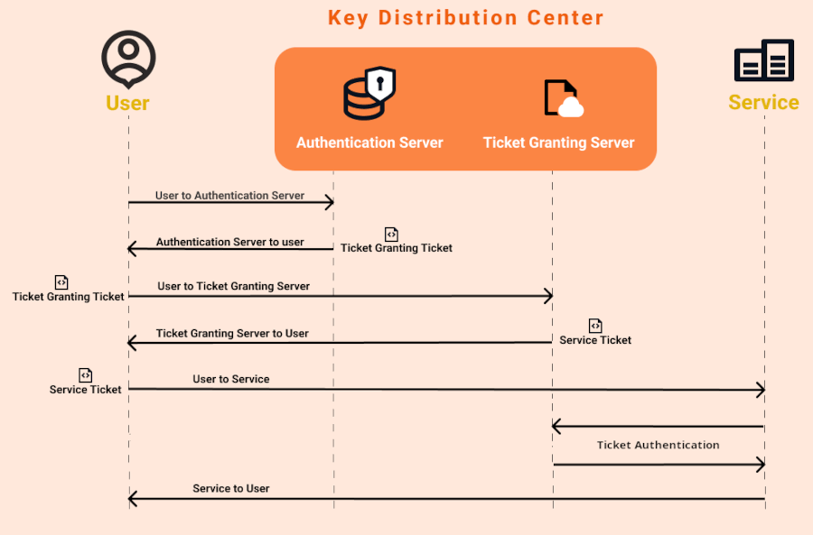
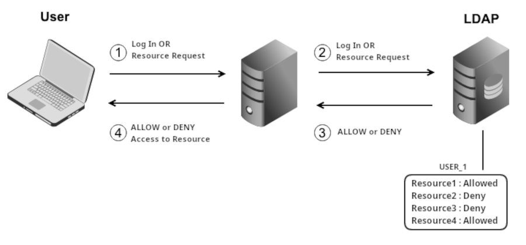
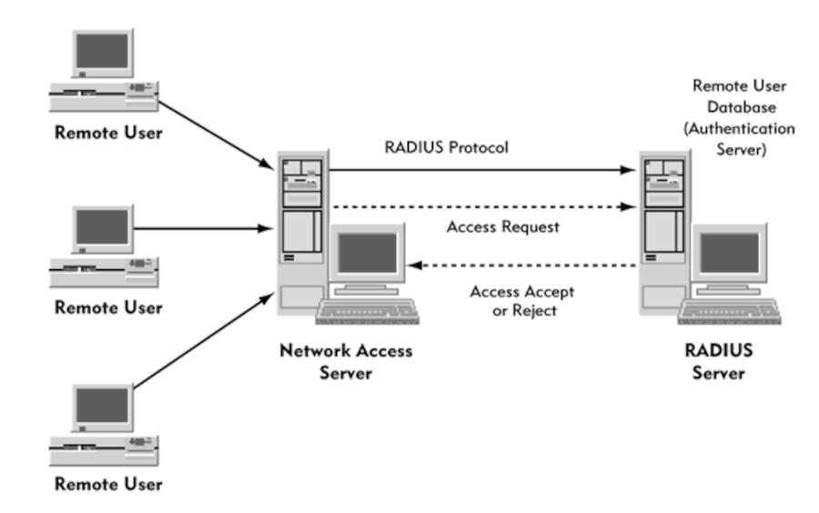

# SECURITY PRACTICES

## USER SECURITY

### AUTHENTICATION METHODS

Traditional ID/Password combination has many security vunerabilities.
- Users might share their credentials.
- Passwords generated by users are easy to guess.
- Each server has own credentials databases, users has to enter credentials everytime.

**Kerberos**

- Single Sign On (SSO)

- The server cache the Ticket using **kint** utility.
- **klist** lists the stored tickets.

**LDAP**

- Lightweight Directory Access Protocol.
- Network admins may use a combination of Kerberos and LDAP.\
  Kerberos for authentication and LDAP for authorization.
- LDAP servers can be distributed among multiple servers.

**RADIUS**

- Remote Authentication Dial-In User Service.
- Radius protocol allows an authentication server to\
  authenticate not only user acoount but other info\
  about the user as well.

**TASCACS+**

- Terminal Access Controller Access Control System.
- Each server seperately send auth requests.
- TASCAS+ has authentication, authorization, accounting features.
- TASCAS+ has encryption.

### MULTIFACTOR AUTHENTICATION

Something Known + Something Possesed

- Biometrics
- Digital Tokens (encrypted file / hardware)
- Public Key Infastructure (assymetric encryption)
- One-Time Password

### UNIQUE USER ACCOUNTS

- "Nonrepudiation", every action taken by a user can be tracked back to the user.
- never assign the same account to multiple users.

### STRONG PASSWORDS

- Complex and Change at a regular interval.
- users can be forced to change password using **/etc/login.defs**.
    * PASS_MAX_DAYS
- enforce strong passwords with PAM & **/etc/pam.d/system-auth**.

### RESTRICT ROOT ACCOUNT

- completely block access.
    + users can use **su** or **sudo**.
    + **/etc/passwd** > root:x:0:0:root:/root:/usr/bin/nologin.
  
- block only specific devices.
    + **/etc/securetty** lists the devices root allowed to login from.
    + if the list is empty root cannot be accessed from any local device.

- block root from SSH.
    + OpenSSH config : **/etc/ssh/sshd_config**.
    + set : **PermitRootLogin no**.

## SYSTEM SECURITY

### SEPERATION OF DATA

- keep seperate partitions for various major mount points.\
  such as  **/** & **/home**. preventing users using too much space.

### DISK ENCRYPTION

- instead of encrypting individual files, encrypt entire drive.
- works at a kernal level.
- kernal automatically decrypts the files when required.
- LUKS uses **dm-crypt** & **cryptmount**.

### RESTRICTING APPLICATIONS

- when multiple users use the system simultaneously.
- data collisions can occur.
- use **chroot** jail,
    + start app in a new root directory structure.
    + `$ sudo chroot starting_dir command`.

### PREVENT UNAUTHORIZED REBOOTING

- preventing attackers physically rebooting and taking control.
    + block access to BIOS/UEFI by setting a BIOS password.
    + preventing access to grub by setting a password.
        * create an encrypted password : `$ grub-mkpasswd-pbkdf2`
        * add the password to grub :\
        **/etc/grub.d/40_custom** file.\
        set superuser [ user_id ]\
        password_pbkdf2 [ user_id ] [ password ]\
        [ password ] is the value from previous command.

- disable the ctrl+alt+del combination
    + for systemd systems.\
    + `$ sudo systemctl mask ctrl-alt-del.target`

### RESTRICTING UNAPPROVED JOBS

- users can run **cron** and **at** jobs, even when they are logged out.
- block unauthorized users from adding cron jobs.
    + **/etc/at.allow** , **/etc/at.deny** , **/etc/cron.allow** , **/etc/cron.deny**.
    + if the user is found in the **allow** file, user is allowed.
    + if the user is not found in **allow**, **deny** is checked.
    + if the user is found in **deny**, user is blocked.
    + if the user is not found in **deny**, user is allowed.

### BANNERS AND MESSAGES

- **/etc/login.warn** : display content of the file, before login prompt.
- **/etc/motd**  : display content of the file, after login.

### RESTRICTING USB DEVICES

- when a user plugin a USB storage drive, kernal looks for a module to support the device.
- if none is found, calls **modprobe** utility to automatically load appropriate module.
- config : **/etc/modprobe.d/blacklist.conf**.
- kernal loads **uas** & **usb:storage** whena usb is connected.
- add **uas** & **usb:storage** to **blacklist.conf**.

### KEEP UP WITH LATEST THREATS

- cve.mitre.org

### AUDITING

- logs are informative, for even more robust solution use **audit** package.
- **audit** allows logging many system events.
    + file / directory access by users.
    + system calls made by apps.
    + specific commands run by users.
    + network access by users.
    + network connections attempted by external users.
- types of rules.
    + system rules : log system calls by apps.
    + file system rules : log access to files & directories.
    + control rules : **audit** behavior.

## NETWORK SECURITY

### DENY HOSTS

- use **/etc/hosts.deny**.

### DISABLE UNUSED SERVICES

- there are many legecy network apps, hanging around the system.
    + FTP
    + Telnet
    + Finger : remotely lookup and find a user.
    + Mail services.

### CHANGE DEFAULT PORTS

- port types
    + well-known ports (0-1023)
    + registered ports (1024-49151)
    + private ports (49151+)

! some admins like to move applications that use well-known ports to private ports.

### SUE ENCRYPTION ON NETWORK

- Do not send plain data through networks.
- use apps with **SSL** and **TLS** support.
