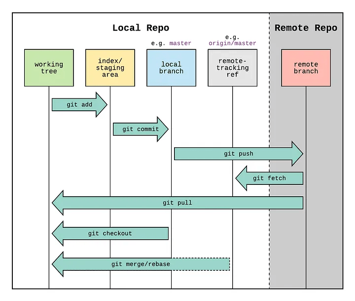

# GIT

- A version control system ( VCS ) provide a common place to store and merge project files.
- It protects files from being overwritten mistakenly when managed by multiple people.
- New members has easy access to the latest version of the project.
- Distributed version control system, allows developers to work offline and submit the work to a remote repository.



| **Component**         | **Description**|
| -                     | - |
| **Working Directory** | - Directory where files are created, modified, and deleted|
| **Staging Area**      | - Located in the same area as the working directory. <br> - Implemented as a hidden **.git** directory. <br> - Files in the working directory are registered in **.git/index**. <br> - Index information includes checksums, timestamps, and filenames. <br> - Git compresses and stores (as blobs) files in **.git/objects/**|
| **Local Repository**  | - Contains the history of each file. <br> - Project tree and commit information are stored as objects in **.git/objects/**|
| **Remote Repository** | - Typically a cloud-based location or a local server. <br> - Examples include GitHub, GitLab, Bitbucket, and Launchpad|

**Git Benifits**,

- Performance : git uses local files to operate.
- History : git creates and stores snapshots.
- Accuracy : git employs checksums to protect file integrity.
- Decentralization : multiple developers can work on the same project, on seperate networks.

---

## SETUP

1. install git.
    + `$ apt -install git` / `$ yum install git`

2. setup git credentials.
    + `$ git config --global user.name "adam"`
    + `$ git config --global user.email "adam@tech.com"`
    + global info is stored in **~/.gitconfig** OR **/etc/gitconfig**.
    + local info is stored in **.git/config**.

3. create working directory.
    + `$ mkdir Project`

4. initialize git directory.
    + `$ git init`

5. confirm git settings.
    + `$ git config --list`

6. check git status.
    + `$ git status`

7. create a gitignore file.
    + `$ touch .gitignore`

8. add entries for any excluded files to .gitignore.
    + `$ echo "env/*" >> .gitignore` / `$ echo "passwords.txt" >> .gitignore`

9. create a README.md file.
    + `$ echo "# MY PROJECT" > README.md`

10. add files to staging area.
    + `$ git add file1.txt` / `$ git add --all` / `$ git add .`

11. commit to local repository.
    + `$ git commit -m "commit_message"`
    + if a commit message is not provided, a text editor will open to enter the message.

12. setup remote repository.
    + `$ git remote add origin https://github.com/adam/my_project.git`
    + the url is provided by the cloud service apone creating a remote repository.
    + `$ git remote rm origin` to remove origin in case of error.
    + `$ git remote -v` to view origins.

13. push to remote repository.
    + `$ git push origin master`
    + cloud service will request credentials if SSH is not setup.

14. checkout the git log.
    + `$ git log`

---

## UPDATE LOCAL FILES

Copy the latest files from the remote repo.

1. `$ git remote add origin https://github.com/adam/my_project.git`
2. `$ git pull -u origin master`

> any modified but un-pushed files in the local repo will cause the **pull** to fail.

---

## CLONE

Clone the entire remote repo to local directory including history.

1. `$ git clone https://github.com/adam/my_project.git`

---

## TAGS

Tagging allows marking specific commits with additional information, such as release number.\
Tagging can be,

- **Lightweight** : only tag name.
    + `$ git tag v2.0`

- **Annotated** : tag name + additional metadata.
    + `$ git tag -a v2.0 -m "official relese 2.0"`

---

## MERGING

Multiple developers can work on multiple features using **Branches**.

- create a branch.
    + `$ git branch feature1`

- move to another branch.
    + `$ git checkout feature1`

- view current branch.
    + `$ git branch` / `$ git status`

```
      master
    * feature1
```

> **!** the **( \* )** indicate the current branch.

- view a branches files.
    + `$ git ls-tree --name-only -r master`

- merge a branch to current branch.
    + `$ git checkout master`
    + `$ git merge feature1`

- rebase on current branch.
> `$ git rebase master` 

> **!** Merging preserves the history of both branches, creating a new “merge commit” that shows the point where two histories combined.\
> **!** Rebasing, on the other hand, moves the entire branch to start from the latest commit of the target branch.

```
Before Merge:
    
    A---B---C (master)
         \
          D---E (feature)

After `git merge feature` (from master):

    A---B---C-------G (master)
         \         /
          D---E---/ (feature)
```
```
Before Rebase:

    A---B---C (master)
         \
          D---E (feature)

After `git rebase master` (from feature):

    A---B---C---D'---E' (feature)
```