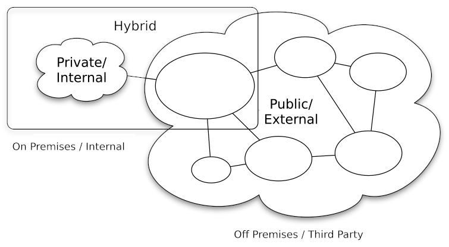
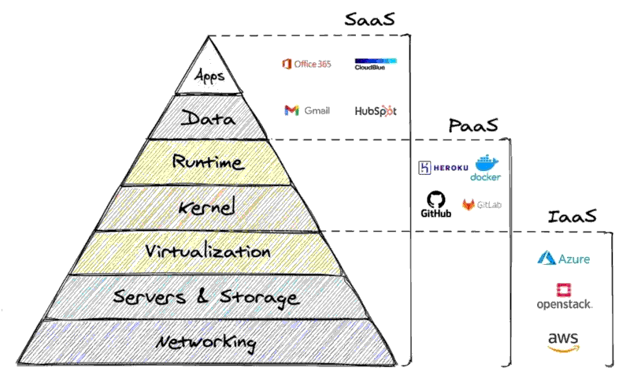
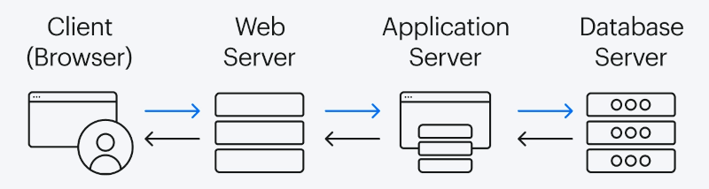
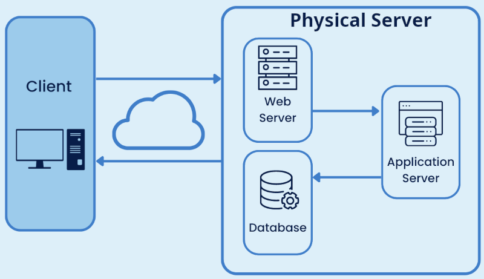
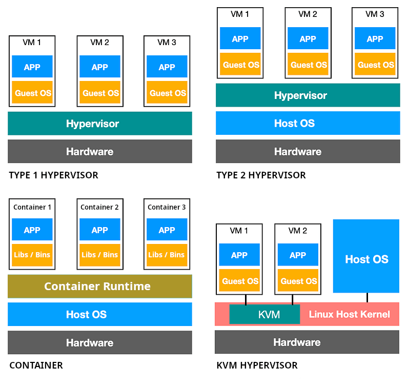

# CLOUD SERVICES & VIRTUALIZATION

## CLOUD SERVICES

- Refer to distributed computing, where resources are shared between systems to accomplish a task.
- AWS / Microsoft Azure / Google Cloud Platform
- there are 3 methods of providing cloud services.
    + Internal / Private : Organization has own computing resources within internal networks.
    + 3rd Party / Public : All the computing resources are provided by an external entity.
    + Hybrid : Some resources are provided internally while supplimentery resources are provided externally.

- there are 3 types of cloud services.
    + IaaS : provide **low level resources** such as hardware.
    + PaaS : provide **hardware and OS**.
    + SaaS : provide complete **application** environments.

## VIRTUAL SYSTEMS

- Traditional Serving use multiple physical servers.

- Virtualized Services.

- with this development, the virtual servers must share physical resources.
    + Type 1 Hypervisor.
    + Type 2 Hypervisor.
    + KVM Hypervisor.
    + Containers.

### TYPE 1 HYPERVISORS

- bare-metal hypervisors.
- allocates resources to virtual machines as required.
- **KVM** is considered a Type 1 hypervisor. ( Intel / AMD )
- **XEN** is a Type 1 hypervisor. ( Intel / AMD / ARM ).

### TYPE 2 HYPERVISORS

- hosted hypervisors.
- run virtual machines as seperate processes on host os.
- **VMware** / **QEMU** / **VirtualBox**.
- open source standard for virtual machine configuration is called **Open Virtualization Format (OVF)**.
- **OVF** uses a signle XML file to define H/W requirements for the virtual machine.
- **OVF** uses other files to define network, virtual drive & other requirements.
- to simplify distribution **Open Virtualization Appliance (OVA)** standard is implemented.
- **OVA** format bundles all the reuired files in to tar archive.

### CONTAINERS

- files required to run an application is scattered throughout the virtual directory.
- container gathers all the files required to run an application.
- application containers are portable.
- since containers don't contain entire OS, it is more lightweight.
- **LXC** is more heavy and involved than lightweight containers.
- **LXC** contains a partial OS.
- **LXD** is used to manage **LXC** containers.
- **LXD** has become a fully fledged Container engine, using **LXC** and managing multiple containers.
- **LXD** currently works only with Linux.
- **Docker** is extremly lightweight.
- **Docker** has a daemon running on the linux system, managing containers.
- Containers built on windows cannot run on a linux host  and vice versa.

#### DOCKER

**docker** utility

    biuld       create a new container image from config file.
    commit      create a new image of an edited container on local syste.
    cp          copies files between local system and container.
    exec        connect to running conatiner and execute a command.
    images      list locally stored containers
    inspect     dtailed information about containers.
    kill        stop a running container.
    login       login to dockerhub.
    logs        retrieve logs from running container.
    ps          list running containers.
    pull        retrieve container from docker container.
    push        commit a container image to docker container.
    rm          delete a stopped container.
    rmi         delete a container from local storage.
    run         start container image.
    stop        stop a running container.
    start       start stopped container.
    attach      connects the host STDIN, STDOUT and STDERR to the container.
