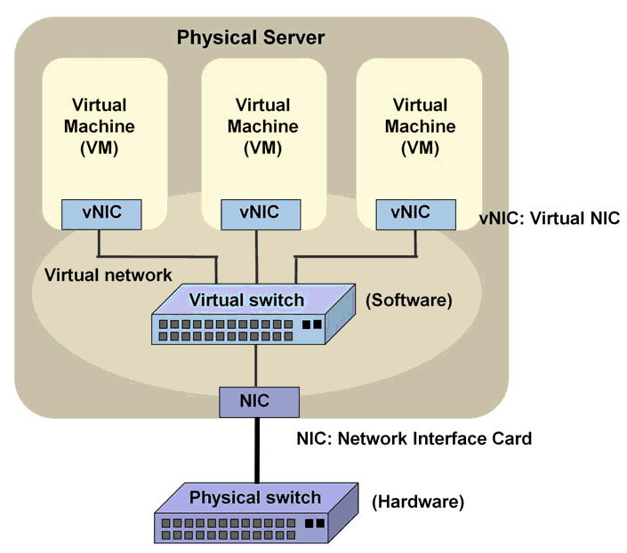
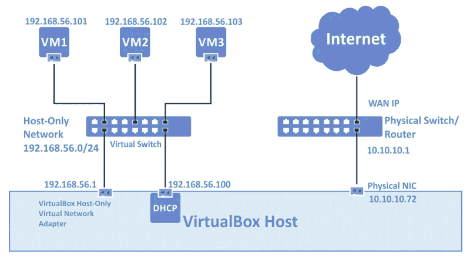
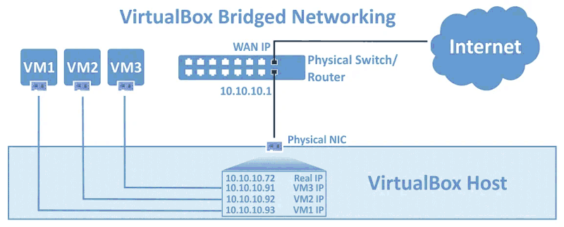
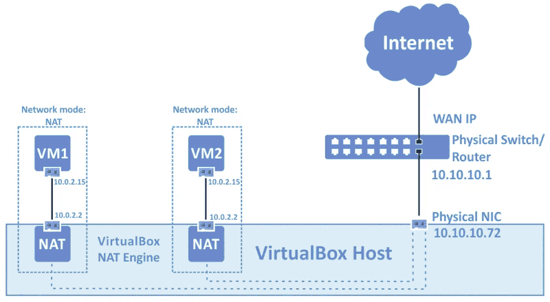
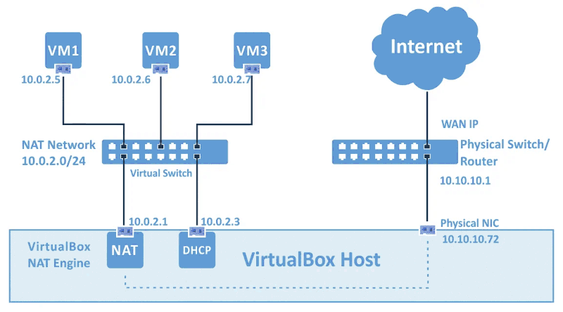

# CLOUD AND VIRTUALIZATION SERVICES

## VIRTUAL MACHINE TOOLS

### libvirt

* **Libvirt** is a widely-used virtualization management software.
* It provides an **API library** used by many open-source hypervisors, including **KVM**.
* The **libvirtd** daemon runs on the host to perform VM management tasks.
* Most CLI tools starting with **"vir"** (like `virsh`, `virt-install`) rely on the **libvirt** library.
* The **libvirt** package includes the **libvirt-client** / **libvirt-clients** sub-package.
* If a hypervisor is installed, **`virsh`** can be used to manage VMs via an interactive shell or shell commands.
* **`virt-install`** is a Python-based tool to create new virtual machines.

```
    $ which virsh
    /usr/bin/virsh

    $ lld /usr/bin/virsh | grep libvirt
    libvirt-lxc.so.0 => /lib64/libvirt-lxc.so.0 (0x00...)
    libvirt.so.0 => /lib64/libvirt.so.0 (0x00...)
    ...
```

---

### virtual machine manager

- not to be confused with hypervisor (VMM).
- is a lightweight desktop application for managing virtual machines.
- `$ virt-manager` package.

---

## VM BOOTSTRAPPING

installing a new system using a config file or image.\
When managing hundreds of VMs, automation scripts are commonly used to streamline the boot process.

- Unattended OS Installation.
    + **Kickstart** : RedHat based ( simple text file )
    + **Preseed** : Debian based ( key-value files )
    + **AutoYaST** : SUSE ( XML files )

---

### kickstart ( RHEL )

| **Action**                        | **Details**|
| -                                 | - |
| **Prepare the environment**       | Set up a network boot server<br>- DHCP server to provide IP addresses and point to the boot server<br>- TFTP server to serve the PXE bootloader<br>- HTTP/FTP/NFS server to host RHEL installation files and Kickstart file|
| **Create a Kickstart file**       | Create manually **( ks.cfg )** or use the generated file from a previous install **( /root/anaconda-ks.cfg )**<br>- Contains encrypted user / root passwords|
| **Store the config file**         | Save **ks.cfg** in a shared location (ie. /var/www/html/rhel8/ for HTTP) or a portable storage|
| **Provide installation source**   | Place ISO / extracted ISO directory in a location accessible to kickstart as well ( ie. along with **ks.cfg** )|
| **Create boot medium**            | For physical installs: Create a live USB or DVD ( Not required for **VMs** or **Network (PXE) boots**)|
| **Initiate Kickstart**            | **Physical systems**: Boot with `linux ks=hd:sda1:/ks.cfg` appended at the prompt<br>**Virtual systems**: Use `virt-install`<br>--> `--initrd-inject /root/VM-Install/ks.cfg`<br>--> `--extra-args="ks=file:/ks.cfg console=tty0 console=ttyS0,115200n8"`<br>--> Automate using a shell script to deploy multiple VMs |

---

### cloud-init ( Ubuntu )

**cloud-init** : Python-based tool used to automate the initialization and configuration of cloud-based virtual machines (VMs) created from cloud images or operating system templates.

#### **Key Features :**

* Applies user-provided configuration and data at VM launch.
* Configurations are defined in **YAML** files / format.
* Paste the configurations to the **user-data** section or pass **user-data.YAML** file during the cloud providers bootstrap process.
* Can be invoked manually ( within the VM ) in case of a local VM, using the **`cloud-init`** command ( install `cloud-init` first ).
* The primary configuration file is located at: **`/etc/cloud/cloud.cfg`**.

#### **Supported Environments :**

* **Cloud Platforms:** AWS, Microsoft Azure, DigitalOcean, etc.
* **Cloud Management Systems:** OpenStack, etc.
* **Local Virtualization:** VMware, KVM, and more.
* Available across most major Linux distributions.

#### **What It Configures :**

* Hostname, temporary mount points, and other system settings.
* Setup pre-generated **OpenSSH keys** for secure access.

---

## STORAGE ISSUES

- A virtual disk can be a single or multiple files representing storage for a VM.
- Disk type impacts virtual system performance.
    + **Provisioning** defines disk space allocation :
        * **Thick provisioning :** full space pre-allocated.
        * **Thin provisioning :** space grows as data is added, but does not shrink when data is deleted; useful for overprovisioning space (ie. LVM) to be physically added later.
    + **Persistent Volumes:** data persists regardless of VM state or deletion (used in OpenStack/Kubernetes).
    + **Blobs (Azure):** large unstructured data accessible over the network, manageable via .NET; include images, streaming video, big data.
        * Similar Blobs are grouped into containers, and each user account has multiple containers.
            - **Block blobs:** binary/text blocks, up to 4.7TB.
            - **Append blobs:** optimized for appending data, used in logs.
            - **Page blobs:** random access files, up to 8TB.

---

## NETWORK CONFIGURATION

Two main network virtualization concepts are,
+ VLAN
+ OVERLAY Network

**VLAN**

- consist of systems and devices on a LAN, the LAN can be distributed physically.
- instead of physical connections, VLAN's are based on logical virtual connections.

**OVERLAY Network**

- use encapsulation and tunneling.
- devices communicate through tunnels.
- applications manage the network infastructure ( SDN ).
- provide scalability and flexibility.

---

**VIRTUAL NIC's**



---

**Host Only**

+ local adpater
+ connects to the virtual nework with in the host.
+ no direct external connections.
+ fast, since communication between VM's is though RAM ( no wires.. ).
+ used with virtual proxy servers.
+ where one VM can act a as proxy (bridged) to forward the traffic of other VM's (host-only).



---

**Bridged**

+ VM gets own IP on the main physical network.
+ used with virtual proxy servers.
+ where one VM can act a as proxy (bridged) to forward the traffic of other VM's (host-only).



---

**NAT**

+ IP's of VM's are hidden behind the NAT table.
+ in virtual settings, NAT table is maintained by the hypervisor.



---

**NAT Network**

+ Similar to NAT but the VM's are on the same virtual network.


