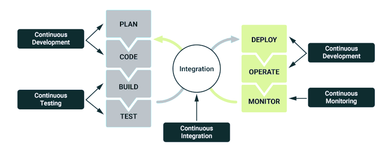
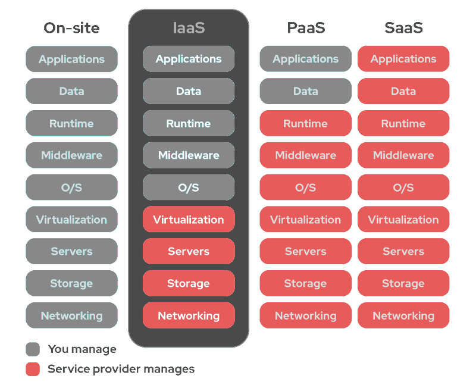
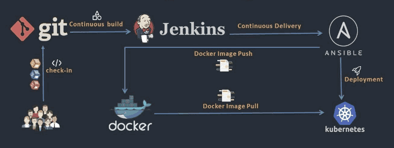
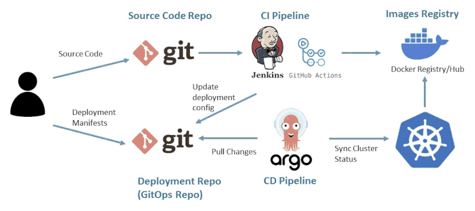

# ORCHESTRATING THE ENVIRONMENT

Balncing and coordinating resources to achieve consistency of desired outcome.

Processes that require orchestration might be,
+ Application development.
+ Configuration management.
+ Disaster recovery.
+ Server monitoring.
+ Security.

---

## DEVOPS

A popular IT orchestration processes.

devops components

- **Continual App Processing** : Leverage Git features to deliver continuous, incremental updates to the application.

- **Controlling App Environment** : Ensure consistency between development and production by aligning OS, hardware, drivers, and libraries.

- **Defining App Environment** : Clearly specify development and production environment requirements, including OS, hardware, software packages, and security protocols.

- **Deploying App Environment** : Use tools like Ansible for automated, continuous deployment of infrastructure and applications to production.

- **Monitoring App Environment** : Monitor operations, log application activity, track performance metrics, and use alerts to detect and respond to issues. Logged data supports future decision-making.

**A Real World Example**

1. Development and production environment is created as a **container**.
2. Container image definitions (ie. **Dockerfiles**) are **registered** in a **version control system**.
3. The production container is replicated using **Kubernetes** for scalability and high availability.
4. Development container configurations and security policies are managed with **Puppet** or **SaltStack**.
5. The development team creates small incremental changes to the codebase.
6. These changes are automatically tested using **Jenkins** or **CircleCI**.
7. After successful testing, the container image is tagged and pushed to a **container registry**.
8. The current production container is stopped, and the new image is deployed in its place.
9. The new deployment is monitored and logged for performance and stability.

---

### ANALYSING ATTRIBUTES

**Virtualization** assist in DevOps,

| **Benefit**               | **Description**|
| -                         | - |
| **Static Environment**    | - Environment remains consistent over time - No unauthorized (`sudo`) updates|
| **Version Controlling**   | - Container images are versioned - Registered with a version control system before production deployment|
| **Replace, Not Update**   | - Existing production container is stopped - New container replaces it and is started|
| **High Availability**     | - Containers are replicated - Individual containers can be replaced without shutting down the entire system|

---

## PROVISIONING INFASTRUCTURE

Much like **physical** infastructure, **virtual** infastructure needs to be managed and controlled.

| **Step**                                  | **Details**|
| -                                         | - |
| **1. Determine the Infrastructure**       | - Operating system - Libraries - Services - Security configuration - Supporting software - Network utilities|
| **2. Document the Infrastructure**        | - Configuration and policy settings are loaded into an Infrastructure as Code (IaC) portal - Known as *automated configuration management* and used later in *build automation*|
| **3. Provide Revision Control**           | - Infrastructure as Code is inserted into an orchestration tool's registry for version control|
| **4. Troubleshoot the Infrastructure**    | - Tech Ops and developers troubleshoot issues - Orchestration tools compare documented configuration to actual production state|

---

## AUTOMATING THE INFASTRUCTURE

### AUTOMATION TOOLS

| **Tool**      | **Developer** | **Language / Format**         | **Key Features**|
| -             | -             | -                             | - |
| **Ansible**   | Red Hat       | YAML, uses Python and JSON    | - Agentless (no software required on remote servers) - Uses OpenSSH and Python to communicate |
| **Chef**      | —             | Ruby                          | - Defines server configurations|
| **Puppet**    | —             | Own declarative language      | - Defines system configuration for remote servers - Requires agent software on remote servers |
| **SaltStack** | VMware        | YAML                          | - Stores server configuration in YAML|
| **Terraform** | HashiCorp     | Own language + JSON           | - Graphs all resources - Enables access for other operators|

#### Agent Vs Agentless

| **Monitoring Type**       | **Description**                                                                                                                                                   | **Pros**                                      | **Cons**|
| -                         | -                                                                                                                                                                 | -                                             | - |
| **Agent Monitoring**      | - Requires software (agent) installed in the application container - Sends event and analysis data (e.g., container crashes) to external monitoring servers    | - Detailed data collection - Customizable  | - Performance impact - Additional software to manage|
| **Agentless Monitoring**  | - Uses pre-existing or embedded tools for monitoring - No need for extra agent installation                                                                    | - Lightweight - Easier initial setup       | - Can be inflexible - Potential maintenance hassles|

---

### INVENTORY

When an application container shuts down, it triggers an event indicating that the **desired state** ( a predefined number of running containers ) is no longer met.\
Container orchestration tools monitor this state and employ **self-healing** mechanisms to automatically redeploy containers, restoring the system to its desired state.

### CONTAINER ORCHESTRATION TOOLS

| **Tool**          | **Developed By**  | **Key Terms / Concepts**                                                                                                                                                                                                                                                      | **Notes**|
| -                 | -                 | -                                                                                                                                                                                                                                                                             | - |
| **Kubernetes**    | Google            | - Also known as **K8s**    - **Cluster Service**: Uses YAML to deploy/manage pods    - **Pod**: Contains one or more containers    - **Worker**: Hosts pods, communicates via kubelet agent    - **YAML File**: Defines container configuration and desired state | Distributed system allows high **flexibility and scalability**|
| **Docker Swarm**  | Docker            | - **Cluster**: A group of Docker containers    - Monitors health and restores **desired state**                                                                                                                                                                            | Generally **faster** than Kubernetes|
| **Mesos**         | Apache            | - Not a full orchestration system    - Acts as a **distributed system kernel**    - Has capability to **create containers**                                                                                                                                             | Often used with other tools (ie. Marathon) to handle orchestration|

