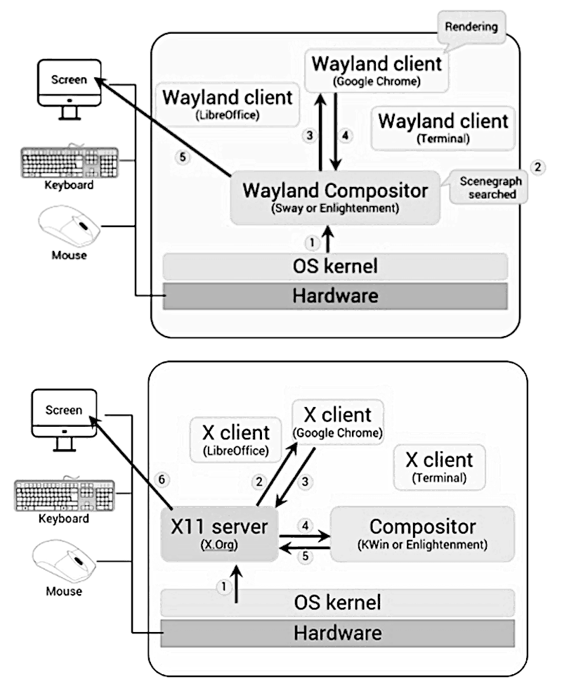
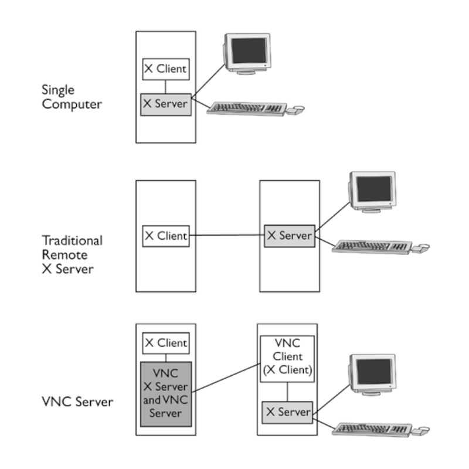

# GRAHICAL USER INTERFACE

**GUI** is a series of components working together to provide a graphical interface.

## DESKTOP ENVIRONMENT

| **Object**            | **Description** |
| -                     | - |
| **Desktop Settings**  | Tools or programs that allow users to configure the appearance and behavior of the desktop environment.|
| **Display Manager**   | The graphical login screen that manages user sessions and authentication.|
| **File Manager**      | A graphical application used to browse, organize, and manage files and folders.|
| **Icons**             | Visual representations of files, applications, or system functions.|
| **Favourites Bar**    | A section of the interface that holds shortcuts to frequently used files or applications.|
| **Launch**            | A feature or tool used to search for and open applications, files, or system settings.|
| **Menus**             | Interface elements, often accessed via an icon, that list actions such as opening, saving, or managing files.|
| **Panels**            | Narrow, rectangular bars typically located at the edges of the screen, containing menus, system indicators, or application launchers.|
| **System Tray**       | A section of a panel that provides quick access to system controls, notifications, and background applications.|
| **Widgets**           | Small, interactive elements (e.g., applets, screenlets) that display information or provide quick access to specific functions.|
| **Window Manager**    | Software that controls how application windows are displayed, moved, and interacted with on the desktop.|

---

| **Component**     | **GNOME (1999)**                  | **KDE Plasma (1996/1998)**| **Cinnamon (2011)**       | **MATE (2011)** |
|-                  |-                                  |-                          |-                          |-|
| Display Manager   |GNOME Display Manager (GDM)        | SDDM                      | LightDM                   | LightDM|
| File Manager      |GNOME Files (formerly Nautilus)    | Dolphin                   | Nemo (Nautils Fork)       | Caja (Nautils Fork)|
| Favourite Bar     |GNOME Shell dash                   | Inside Application Menu   | Inside Application Menu   | Inside Application Menu|
| Widgets           |(Uses extensions, not traditional) | Plasmoids                 | Cinnamon Spices           | Screenlets|
| Window Manager    |Mutter                             | KWin                      | Muffin (Mutter Fork)      | Marco|

---

## ACCESSIBILITY

**VISUALLY IMPAIRED**

| Feature           | Description |
|-                  |-|
| Cursor Blinking   | Increases the cursor blinking rate for better visibility.|
| Cursor Size       | Enlarges the cursor to make it easier to see.|
| High Contrast     | Enhances contrast by brightening windows and darkening edges, text, and cursor.|
| Large Text        | Increases the system font size for better readability.|
| Screen Reader     | Reads the user interface out loud for non-visual access.|
| Sound Keys        | Plays a sound when Caps Lock, Num Lock, or Scroll Lock is activated.|
| Zoom              | Magnifies the entire screen or a selected portion of it.|

**HEARING IMPARED**

| Feature       | Description |
|-              |-|
| Visual Flash  | Displays a visual alert (e.g., screen flash) when system sounds are triggered. |

**PHYSICALLY IMPARED**

| Feature                   | Description |
|-                          |-|
| Bounce Keys               | Ignores repeated keystrokes caused by accidentally pressing a key multiple times.|
| Double-Click Delay        | Extends the time window allowed between clicks to register a double-click.|
| Gestures                  | Launches programs using custom combinations of mouse clicks and keyboard keys.|
| Hover Click               | Triggers a click when the pointer hovers over an item for a set duration.|
| Mouse Keys                | Uses the keyboard to control the mouse pointer.|
| Repeat Keys               | Adjusts how long a key must be held down before it repeats input.|
| On-Screen Keyboard        | Provides a virtual keyboard that can be used with a mouse or alternative input.|
| Simulated Secondary Click | Assigns a key to be held during a click to perform a right-click action.|
| Slow Keys                 | Adds a delay before a keystroke is registered to prevent accidental presses.|
| Sticky Keys               | Allows modifier keys (e.g., Ctrl, Shift) to remain active until another key is pressed.|

---

## DISPLAY SERVER

> **!** A **compositor** is a component of a graphical system that combines (composites)\
> individual application windows into a single final image that is displayed on the screen.



### WAYLAND SERVER

- Wayland is a modern replacement for the X11 display server.
- It was introduced in 2009 to provide a simpler and more efficient protocol for compositors and clients.
- Instead of the default Weston compositor, other compositors such as Arcan, Sway, Clayland, Lipstick, and more can be used with Wayland.

> **!** CHECK IF WAYLAND IS RUNNING
>```
>    $ echo $WAYLAND_DISPLAY
>```
> - If this returns a value, it means a Wayland display server is active.
> - If no response is returned, the system is likely running an X11 session.

**TROUBLESHOOTING**

If you experience display problems, try the following steps:
- Switch to an X11 session to see if the issue persists.
- Verify that your graphics card supports Wayland.
- If your current distribution uses a different compositor, try installing and running the Weston compositor.

---

### X11 SERVER

- X Window System originated in **1980**.
- Press **CTRL + ALT + BackSpace** to restart the X11 server.
- Xorg configuration file --> **/etc/X11/xorg.conf**

> **!** This file is typically not edited manually anymore since most modern systems configure the session dynamically by autodetecting hardware.

**Xorg configuration file sections include:**

| **Section**       | **Description** |
| -                 | - |
| **Input Device**  | Settings for mouse and keyboard|
| **Monitor**       | Monitor-specific configurations|
| **Modes**         | Video modes|
| **Device**        | Video card/session device settings|
| **Screen**        | Screen resolution and color depth|
| **Modules**       | Modules to be loaded by the server|
| **Files**         | Paths to fonts, keyboard layouts, and other resources|
| **ServerFlags**   | Global X server options|
| **ServerLayout**  | Links input and output devices, defining the overall layout|

**TROUBLESHOOTING**

1. autodetection fail :
    - Run `$ sudo Xorg -configure` to generate a configuration file in the current directory.
    - Move the **generated file** to the appropriate directory, usually **/etc/X11/xorg.conf**.
2. `xdpyinfo`
    - information on xserver screen types, communication params, protocol extentions, etc...
3. `xwininfo`
    - information on windows, incase of no options an interactive mode to select windows.
    - information such as width, height, color map id, etc...
    - command will hang in case of wayland session.

---

## REMOTE DESKTOPS

Used when a fully functional desktop is required instead of SSH for a remote server.

- **VNC**
- **Xrdp**
- **NX**
- **SPICE**

### VNC

**PROCESS**

| **Step**                      | **Description**|
| -                             | - |
| **1. Connection Initiation**  | Client connects to the server using TCP/IP, usually on port **5900 + display number** (ie. 5901 for display 1)<br>Alternatively display number can be directly given instead of port number|
| **2. Protocol Negotiation**   | Client and server agree on the RFB **(Remote Framebuffer)** protocol version and choose an **authentication method**|
| **3. Authentication**         | Authentication is performed ( no auth / password / TLS encryption )|
| **4. Session Setup**          | Server sends the initial **framebuffer (screen content)** to the client. Client displays it in a window|
| **5. Ongoing Communication**  | • **Server → Client**: Sends **screen updates** (only changed parts).<br>• **Client → Server**: Sends **keyboard and mouse input**|



**PROs & CONs**

| **Category**  | **Point**                     | **Description** |
| -             | -                             | - |
| **Pros**      | Flexibility                   | VNC can be used across different operating systems and environments|
|               | Multi-user desktops           | Multiple users can access separate desktop sessions on the same server|
|               | **Persistent/static desktops**| Persistent desktop sessions remain active even if the client disconnects, allowing users to resume work later.<br>Static desktops does not provide saved states |
|               | On-demand desktops            | Desktops can be created dynamically as users connect|
|               | SSH tunneling support         | VNC connections can be tunneled securely through SSH, including via the `vncviewer` CLI|
| **Cons**      | No file or audio transfer     | VNC does not support local file mounting or audio redirection by default|
|               | No printing support           | There is no built-in support for printing services over the VNC protocol|
|               | No default encryption         | Traffic is unencrypted unless an SSH tunnel or external encryption is used|
|               | Weak password security        | Passwords may be stored in plain text on the server, posing a security risk|


> **!** cli command must be issued in a graphical user session, else command will fail.

---

### XRDP

- Provides support for **Remote Desktop Protocol (RDP)**
- Operates as a **RDP server ( only server-side daemon )** on port **3389**.
- Compatible with RDP clients such as **rdesktop, FreeRDP, Microsoft Remote Desktop** and others on the client side

| **Features**|
| - |
|xrdp uses the **Remote Desktop Protocol (RDP)**, which supports **TLS encryption** for secure traffic|
|Compatible with a **wide range of RDP clients**, including Windows' built-in Remote Desktop, FreeRDP, Remmina, etc.|
|Can **reconnect to existing desktop sessions**, allowing users to resume work without starting over|
|Supports **audio redirection** and **mounting local drives** on the remote system for file transfer|
|Main configuration is in **/etc/xrdp/xrdp.ini**|
|**Security layer setting**<br>In **xrdp.ini**, the **security_layer** directive controls encryption negotiation<br>• **tls** : Encrypts the session with **TLS**<br>• **negotiate** : Tries to negotiate the best method with the client<br>• **rdp** :  Uses standard RDP encryption (NOT SECURE)|

---

### NX

* Was open source until version 4.
* Free and open-source derivatives exist, such as **FreeNX**, **X2Go**, etc.
* Compresses X11 data to reduce bandwidth usage over the network.

|**Features**|
|-|
|Excellent responsiveness and low latency, even on low-bandwidth connections|
|Faster than most VNC-based solutions|
|Traffic is encrypted by default using **OpenSSH**|
|Supports multiple users through a single network port|

---

### SPICE

* Simple Protocol for Independent Computing Environments.
* An open-source protocol developed by **Red Hat**.
* Similar to VNC, it provides remote desktop access to **KVM** virtual machines.

|**Features**|
|-|
|Platform-independent|
|Supports multiple simultaneous clients|
|Delivers performance close to a local desktop experience|
|Low CPU usage|
|High-quality video streaming|
|Supports **live migration**, allowing uninterrupted sessions when a VM is moved to a different host|

---

## FORWARDING

- providing security through SSH port forwarding (SSH tunneling).
- **OpenSSH** service must be running and listening on **port 22**.
- check config file for **"AllowTcpForwarding"** is set to "yes" --> **/etc/ssh/sshd_config** .
- even if the **"AllowTcpForwarding"** is **commented out**, it is eanbled as it is the default behavior.
- port forwarding can be,
    + **local**
    + **remote**
    + **dynamic**

| **Local Port Forwarding (LFP)**                                                   | **Remote Port Forwarding (RFP)** |
| -                                                                                 | - |
|Access a remote service from the local machine                                     | Allow a remote machine to access a service on the local machine|
|**Local → Remote**                                                                 | **Remote → Local**|
|Access a remote database as if it's running locally                                | Expose a local web server to the remote machine or others via SSH server|
|1. SSH client opens a local port on your machine  <br> 2. Traffic sent to that port is encrypted <br> 3. SSH sends the traffic to the destination on the remote host| 1. SSH server opens a port on the remote side <br> 2. Traffic sent to that remote port is tunneled <br> 3. Tunnel delivers it to your local machine |
|`ssh -L [local_port]:[remote_host]:[remote_port] user@ssh_server`                  | `ssh -R [remote_port]:[local_host]:[local_port] user@ssh_server`|
|`ssh -L 3306:db.example.com:3306 -Nf user@ssh_server`                              | `ssh -R 8080:localhost:3000 -Nf user@ssh_server`|
| • -L : local<br>• -N : no remote terminal<br>• -f : move to background after auth |• -R : remote<br>• -N : no remote terminal<br>• -f : move to background after auth|

> **!** ***X11 FORWARDING***\
> **!** check config file for **"x11Forwarding"** is set to "yes" --> **/etc/ssh/sshd_config**\
> **!** x11 forwarding : `$ ssh -X user@RemoteHost`
